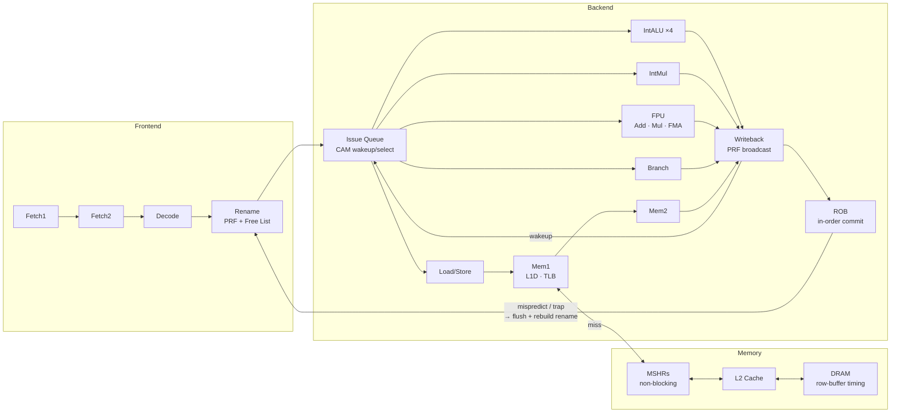

# rvsim

A cycle-accurate RISC-V 64-bit simulator written in Rust with a clean Python API. Models a full out-of-order superscalar processor — physical register file, CAM-style issue queue, ROB, load queue, non-blocking caches, DRAM timing — and exposes everything through a composable Python interface for architecture research and design-space exploration.

```python
from rvsim import Config, BranchPredictor, Cache, Backend, Environment

config = Config(
    width=4,
    backend=Backend.OutOfOrder(rob_size=128, issue_queue_size=32, prf_gpr_size=256),
    branch_predictor=BranchPredictor.TAGE(),
    l1i=Cache("32KB", ways=8, latency=1),
    l1d=Cache("32KB", ways=8, latency=1),
    l2=Cache("256KB", ways=8, latency=10),
)

result = Environment(binary="software/bin/programs/qsort.elf", config=config).run()
print(result.stats.query("ipc|branch|miss"))
```

## Out-of-Order Pipeline



- **Physical register file** with free list and speculative rename map — committed map restored on trap
- **CAM-style issue queue** with wakeup/select: operands broadcast on writeback, dependents wake and issue the next cycle
- **Reorder buffer** for in-order commit with precise exception support
- **Load queue** for memory ordering violation detection and replay
- **Store buffer** with store-to-load forwarding and speculative draining
- **Functional unit pool** with configurable counts and latencies — structural hazard modeling
- **Speculative load wakeup** when MSHRs are available: dependents issue optimistically, cancelled on L1D miss
- **Branch misprediction recovery**: rename map rebuilt from committed state + surviving ROB entries

The in-order backend uses the same front-end and shared pipeline stages, making both modes directly comparable.

## Memory System

- **SV39 virtual memory** with separate iTLB and dTLB, shared L2 TLB, and a full page table walker
- **Non-blocking caches** via MSHRs — L1D misses park in the MSHR, the pipeline continues, waiters resume when the line arrives
- **Configurable cache hierarchy**: L1i, L1d, L2, L3 with LRU/PLRU/FIFO/Random/MRU replacement
- **Prefetchers**: next-line, stride, stream, tagged — configurable per cache level
- **Inclusive/exclusive** cache policies with eviction tracking
- **DRAM controller** with row-buffer aware timing (tCAS, tRAS, tPRE, row miss latency)

## ISA

RV64IMAFDC — base integer, multiply/divide, atomics, single/double-precision float, compressed. Privileged ISA with M/S/U modes, full CSR set, trap delegation, and a CLINT timer.

Passes all 134 tests in [`riscv-software-src/riscv-tests`](https://github.com/riscv-software-src/riscv-tests) (rv64ui, rv64um, rv64ua, rv64uf, rv64ud, rv64uc, rv64mi, rv64si).

## Python API

Install:

```bash
pip install rvsim
```

### Configuration

Everything is a composable dataclass. `Config.replace()` makes sweep variants easy:

```python
from rvsim import Config, Cache, Backend, BranchPredictor, Prefetcher, MemoryController, Fu

config = Config(
    width=4,
    backend=Backend.OutOfOrder(
        rob_size=128,
        issue_queue_size=32,
        load_queue_size=32,
        store_buffer_size=32,
        prf_gpr_size=256,
        prf_fpr_size=128,
        load_ports=2,
        store_ports=1,
        fu_config=Fu([
            Fu.IntAlu(count=4, latency=1),
            Fu.IntMul(count=1, latency=3),
            Fu.FpFma(count=2, latency=5),
            Fu.Branch(count=2, latency=1),
            Fu.Mem(count=2, latency=1),
        ]),
    ),
    branch_predictor=BranchPredictor.TAGE(num_banks=4, table_size=2048),
    l1i=Cache("32KB", ways=8, latency=1, prefetcher=Prefetcher.NextLine()),
    l1d=Cache("32KB", ways=8, latency=1, mshr_count=8, prefetcher=Prefetcher.Stride()),
    l2=Cache("256KB", ways=8, latency=10),
    memory_controller=MemoryController.DRAM(t_cas=14, t_ras=14, row_miss_latency=120),
)
```

### Running and inspecting

```python
from rvsim import Config, Environment, Simulator

# High-level: run a binary and get stats
result = Environment(binary="software/bin/programs/mandelbrot.elf", config=config).run()
print(result.stats.query("ipc|branch|miss"))
print(f"wall time: {result.wall_time_sec:.2f}s")

# Low-level: tick the pipeline manually
cpu = Simulator().config(config).binary("software/bin/programs/qsort.elf").build()

for _ in range(1000):
    cpu.tick()
    snap = cpu.pipeline_snapshot()
    snap.visualize()                  # prints a pipeline diagram

# Run until a specific PC or privilege level
cpu.run_until(pc=0x80001234)
cpu.run_until(privilege="U")

# Inspect architectural state
from rvsim import reg, csr
print(hex(cpu.regs[reg.A0]))
print(hex(cpu.regs[reg.SP]))
print(hex(cpu.csrs[csr.MSTATUS]))
print(hex(cpu.csrs[csr.SEPC]))
print(cpu.mem64[0x80001000])
```

### Comparing configurations

```python
from rvsim import Stats

rows = {}
for bp_name, bp in [("GShare", BranchPredictor.GShare()), ("TAGE", BranchPredictor.TAGE())]:
    cfg = Config(width=4, branch_predictor=bp, uart_quiet=True)
    r = Environment(binary="software/bin/programs/maze.elf", config=cfg).run()
    rows[bp_name] = r.stats.query("ipc|branch_accuracy|mispredictions")

print(Stats.tabulate(rows, title="Branch Predictor Comparison"))
```

### Parallel sweeps

```python
from rvsim import Sweep, Config, Cache

binaries = [
    "software/bin/programs/mandelbrot.elf",
    "software/bin/programs/qsort.elf",
    "software/bin/programs/maze.elf",
]

configs = {
    f"L1={size}": Config(width=4, l1d=Cache(size, ways=8), uart_quiet=True)
    for size in ["8KB", "16KB", "32KB", "64KB"]
}

results = Sweep(binaries=binaries, configs=configs).run(parallel=True)
results.compare(metrics=["ipc", "l1d_miss_rate"], baseline="L1=8KB")
```

`Sweep` distributes work across CPU cores using `ProcessPoolExecutor`.

### Checkpointing

```python
cpu.run_until(pc=0x80002000)
cpu.save("checkpoint.bin")          # snapshot full architectural + pipeline state

# later
cpu.restore("checkpoint.bin")
cpu.run(limit=10_000_000)
```

## Analysis Scripts

`scripts/analysis/` — ready-to-run design-space exploration:

| Script | What it does |
|--------|-------------|
| `width_scaling.py` | IPC vs superscalar width across programs |
| `branch_predict.py` | Accuracy and misprediction rate for all predictors |
| `cache_sweep.py` | L1D size vs miss rate across workloads |
| `inst_mix.py` | Instruction class breakdown (ALU/FP/load/store/branch) |
| `stall_breakdown.py` | Stall cycle attribution: memory / control / data / structural |
| `top_down.py` | Top-down microarchitecture analysis |
| `o3_inorder.py` | Out-of-order vs in-order IPC comparison |
| `design_space.py` | Full multi-dimensional design-space sweep |

```bash
python scripts/analysis/width_scaling.py --bp TAGE --widths 1 2 4 8
python scripts/analysis/branch_predict.py --width 4 --programs maze qsort mandelbrot
python scripts/analysis/cache_sweep.py --sizes 8KB 16KB 32KB 64KB
python scripts/analysis/o3_inorder.py
```

Machine model configs in `scripts/benchmarks/` (P550, M1, Cortex-A72):

```bash
python scripts/benchmarks/p550/run.py
python scripts/benchmarks/m1/run.py
python scripts/benchmarks/tests/compare_p550_m1.py
```

## Building from Source

**Requirements:** Rust 2024 edition · Python 3.10+ · `maturin` · `riscv64-unknown-elf-gcc`

```bash
make build        # Compile Rust core and install Python bindings (editable)
make software     # Build libc and example programs
make test         # Run Rust test suite
make lint         # fmt-check + clippy
make clean        # Remove all build artifacts
```

## Linux Boot (Experimental)

The simulator can boot Linux through OpenSBI. Full boot is still in progress.

```bash
make linux        # Download and build Linux + rootfs via Buildroot
make run-linux    # Boot Linux
```

## License

Licensed under either of [MIT](LICENSE-MIT) or [Apache-2.0](LICENSE-APACHE), at your option.
