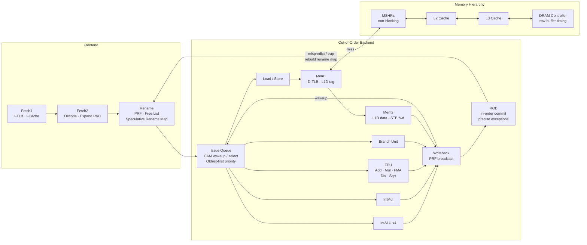
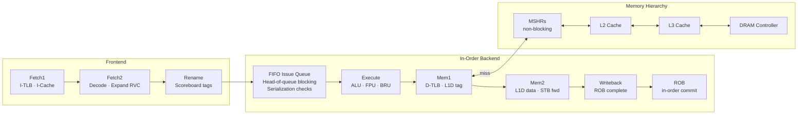
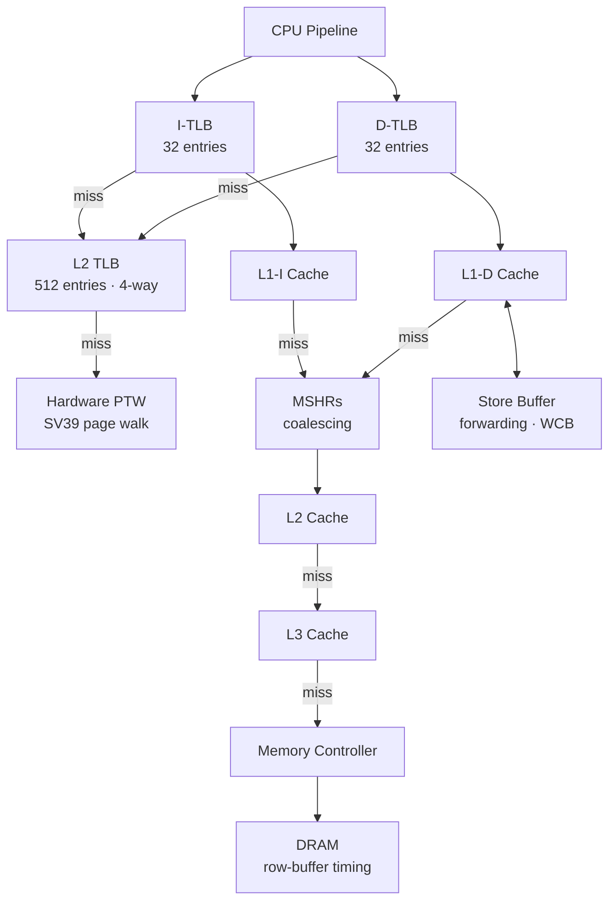

<div align="center">

# rvsim

**Cycle-accurate RISC-V 64-bit system simulator** · Rust core · Python API

[](#isa)
[](#isa)
[](#linux-boot)
[](#license)
[](https://pypi.org/project/rvsim/)
[](https://crates.io/crates/rvsim-core)

</div>

Models a full superscalar processor with two pluggable backends (out-of-order and in-order) — physical register file, CAM-style issue queue with wakeup/select, reorder buffer, load queue, non-blocking caches with MSHRs, DRAM row-buffer timing, SV39 virtual memory, and a complete SoC with VirtIO, UART, PLIC, CLINT, and RTC. Boots Linux 6.6 through OpenSBI to a BusyBox shell.

Everything is exposed through a composable Python API for architecture research and design-space exploration.

```python
from rvsim import Config, BranchPredictor, Cache, Backend, Environment

config = Config(
    width=4,
    backend=Backend.OutOfOrder(rob_size=128, issue_queue_size=32, prf_gpr_size=256),
    branch_predictor=BranchPredictor.TAGE(),
    l1i=Cache("32KB", ways=8, latency=1),
    l1d=Cache("32KB", ways=8, latency=1),
    l2=Cache("256KB", ways=8, latency=10),
)

result = Environment(binary="software/bin/programs/qsort.elf", config=config).run()
print(result.stats.query("ipc|branch|miss"))
```

---

## Architecture

### Out-of-Order Pipeline

10-stage superscalar pipeline with speculative execution, register renaming, and precise exceptions.



**Design choices:**

- **Physical register file** with free list and dual rename maps (speculative + committed). On trap, the committed map is restored in one cycle. On branch mispredict, the speculative map is rebuilt from surviving ROB entries.
- **CAM-style issue queue** with wakeup/select. Results broadcast physical register tags on writeback; dependents wake and issue the next cycle. Oldest-first selection with per-type port limits (configurable load/store ports).
- **Serialization enforcement**: system/CSR instructions wait for all older instructions to complete (`all_before_completed`). FENCE instructions wait for matching predecessor operations (`fence_pred_satisfied`). Loads/stores are blocked by older in-flight FENCE instructions (`has_fence_blocking`). Loads wait for older store address resolution (`has_unresolved_store_before`).
- **Reorder buffer** (circular buffer with O(1) tag lookup via HashMap) for in-order commit with precise exception support. Supports partial flush after branch misprediction.
- **Load queue** for memory ordering violation detection — replays loads when an older store resolves to an overlapping address.
- **Store buffer** with store-to-load forwarding (full and partial overlap detection), speculative draining via write-combining buffer, and `flush_after` for partial pipeline flush.
- **Configurable FU pool** — per-unit-type counts and latencies with structural hazard modeling.
- **Branch misprediction recovery**: GHR repaired from snapshot, RAS restored from snapshot pointer, rename map rebuilt, pipeline flushed after the mispredicting instruction's ROB tag.

### In-Order Pipeline

Uses the same frontend and shared backend stages (commit, memory1, memory2, writeback), making both modes directly comparable on identical workloads.



**Design choices:**

- **Scoreboard-based operand tracking** instead of physical register renaming. Tags captured at rename time point to ROB entries; the issue stage reads completed results via tag bypass or falls back to the architectural register file.
- **FIFO issue with head-of-queue blocking** — if the oldest instruction's operands aren't ready, nothing behind it can issue.
- **Backpressure** via `execute_mem1` latch occupancy — issue+execute is skipped when the previous result hasn't drained through memory1.
- **Same serialization guarantees** as O3: system/CSR, FENCE, and load-after-store ordering checks are enforced at issue time, preventing instructions from executing while older operations are still in flight.

---

## Memory System



- **SV39 virtual memory** — separate iTLB and dTLB (fully-associative, 32 entries default), shared 4-way L2 TLB (512 entries), full hardware page table walker with A/D bit management
- **Non-blocking caches** via MSHRs — L1D misses park in Miss Status Holding Registers while the pipeline continues; coalescing merges requests to the same cache line; waiters resume when the line arrives
- **L1i / L1d / L2 / L3** — independently configurable size, associativity, latency, and replacement policy
- **Replacement policies**: LRU, Pseudo-LRU (tree-based), FIFO, Random, MRU
- **Hardware prefetchers** per cache level: next-line, stride (PC-indexed), stream (sequential detection), tagged (prefetch-on-prefetch)
- **Inclusion policies**: Non-inclusive (default), Inclusive (back-invalidation on L2 eviction), Exclusive (swap between L1 and L2)
- **Write-combining buffer** — coalesces stores to the same cache line before draining to L1D, reducing cache write port pressure
- **DRAM controller** — row-buffer aware timing with configurable tCAS, tRAS, tPRE, row-miss latency, bank count, row size, tRRD (bank-to-bank), tREFI/tRFC (refresh)

---

## Branch Prediction

Five pluggable predictors with shared infrastructure (BTB, RAS, GHR):

| Predictor | Description |
|-----------|-------------|
| **Static** | Always predict not-taken. Baseline for comparison. |
| **GShare** | XOR of PC and global history indexes a pattern history table of 2-bit saturating counters. |
| **Tournament** | Two-level adaptive: local history table + global history, with a meta-predictor to select between them. |
| **Perceptron** | Neural branch predictor — each table entry is a vector of weights trained on global history bits. |
| **TAGE** | Tagged Geometric History Length. Multiple tagged tables with geometrically increasing history lengths (default: 5, 11, 22, 44, 89, 178, 356, 712 bits). Includes loop predictor for counted loops and statistical corrector. |

**Shared components:**

- **BTB** (Branch Target Buffer) — set-associative (256 entries, 4-way default) for indirect jump target prediction
- **RAS** (Return Address Stack) — circular buffer (8 entries default) with snapshot/restore for speculative recovery. Per RISC-V spec Table 2.1: both x1 (ra) and x5 (t0) are recognized as link registers, with coroutine swap detection (pop-then-push for `jalr` where rd and rs1 are different link registers)
- **GHR** (Global History Register) — arbitrary-length bit vector with speculative update and repair from per-instruction snapshots

---

## ISA

**RV64IMAFDC** with full privileged architecture:

| Extension | Coverage |
|-----------|----------|
| **RV64I** | Base 64-bit integer: arithmetic, logic, shifts, branches, jumps, loads/stores, CSR access, ECALL/EBREAK |
| **M** | Integer multiply/divide: MUL, MULH, MULHSU, MULHU, DIV, DIVU, REM, REMU (+ W variants) |
| **A** | Atomics: LR/SC (with forward progress guarantee), AMO operations (SWAP, ADD, AND, OR, XOR, MIN, MAX, MINU, MAXU) |
| **F** | Single-precision IEEE 754 float: arithmetic, FMA, comparisons, conversions, classification, NaN-boxing per spec section 12.2 |
| **D** | Double-precision IEEE 754 float: full parity with F extension |
| **C** | Compressed (16-bit) instruction encoding: expanded to 32-bit equivalents at decode |
| **Privileged** | M/S/U modes, full CSR set (mstatus, sstatus, satp, medeleg, mideleg, etc.), trap delegation, MRET/SRET, WFI, SFENCE.VMA with ASID, FENCE/FENCE.I, PMP (16 regions) |

Passes all **134/134 tests** in [`riscv-software-src/riscv-tests`](https://github.com/riscv-software-src/riscv-tests):
rv64ui, rv64um, rv64ua, rv64uf, rv64ud, rv64uc, rv64mi, rv64si.

---

## SoC

Complete system-on-chip modeled after the QEMU `virt` machine, capable of booting unmodified Linux kernels:

| Device | Address | Description |
|--------|---------|-------------|
| **CLINT** | `0x0200_0000` | Core Local Interruptor — mtime/mtimecmp timer with configurable divider |
| **PLIC** | `0x0C00_0000` | Platform-Level Interrupt Controller — 53 sources, 2 contexts, priority arbitration |
| **UART** | `0x1000_0000` | 16550A-compatible serial port with interrupt support |
| **Goldfish RTC** | `0x0010_1000` | Real-time clock for wall-clock time |
| **SYSCON** | `0x0010_0000` | System controller — poweroff and reboot signals |
| **VirtIO Disk** | `0x9000_0000` | VirtIO MMIO block device with virtqueue DMA |
| **HTIF** | configurable | Host-Target Interface for riscv-tests pass/fail detection |

**Boot flow:** Firmware (OpenSBI) loads at `0x8000_0000`, kernel at `0x8020_0000`, DTB auto-generated at `0x8220_0000`. The DTB is synthesized from the active configuration (memory size, device addresses, ISA string).

---

## Statistics

Every run produces detailed microarchitectural statistics:

- **Cycle accounting**: retiring, ROB-empty, ROB-stall, WFI, per-cycle retirement histogram
- **Privilege breakdown**: cycles in U/S/M mode
- **Pipeline stalls**: memory, control (misprediction), data (RAW hazard), FU structural, backpressure, dispatch
- **Branch prediction**: committed and speculative accuracy, misprediction counts
- **Pipeline flushes**: total, branch-caused, system-caused, squashed instruction count
- **Cache hierarchy**: per-level accesses, hits, miss rates
- **Memory subsystem**: MSHR allocations/coalesces, load replays, inclusion back-invalidations, WCB coalesces/drains
- **Prefetching**: dedup counts per cache level
- **Instruction mix**: ALU, load, store, branch, system, FP (load/store/arith/FMA/div-sqrt)
- **FU utilization**: per-unit-type busy cycles (O3 backend)

---

## Python API

```bash
pip install rvsim
```

> [PyPI package](https://pypi.org/project/rvsim/) · [crates.io (Rust core)](https://crates.io/crates/rvsim-core)

### Configuration

Everything is composable. Mix and match backends, predictors, caches, and FU configs:

```python
from rvsim import Config, Cache, Backend, BranchPredictor, Prefetcher, MemoryController, Fu

config = Config(
    width=4,
    backend=Backend.OutOfOrder(
        rob_size=128,
        issue_queue_size=32,
        load_queue_size=32,
        store_buffer_size=32,
        prf_gpr_size=256,
        prf_fpr_size=128,
        load_ports=2,
        store_ports=1,
        fu_config=Fu([
            Fu.IntAlu(count=4, latency=1),
            Fu.IntMul(count=1, latency=3),
            Fu.FpFma(count=2, latency=5),
            Fu.Branch(count=2, latency=1),
            Fu.Mem(count=2, latency=1),
        ]),
    ),
    branch_predictor=BranchPredictor.TAGE(num_banks=4, table_size=2048),
    l1i=Cache("32KB", ways=8, latency=1, prefetcher=Prefetcher.NextLine()),
    l1d=Cache("32KB", ways=8, latency=1, mshr_count=8, prefetcher=Prefetcher.Stride()),
    l2=Cache("256KB", ways=8, latency=10),
    memory_controller=MemoryController.DRAM(t_cas=14, t_ras=14, row_miss_latency=120),
)
```

### Running and inspecting

```python
from rvsim import Environment, Simulator, reg, csr

# High-level: run a binary, get stats
result = Environment(binary="software/bin/programs/mandelbrot.elf", config=config).run()
print(result.stats.query("ipc|branch|miss"))

# Low-level: tick the pipeline manually and watch it
cpu = Simulator().config(config).binary("software/bin/programs/qsort.elf").build()

for _ in range(1000):
    cpu.tick()
    cpu.pipeline_snapshot().visualize()   # live pipeline diagram

# Run until a specific PC or privilege level
cpu.run_until(pc=0x80001234)
cpu.run_until(privilege="U")

# Inspect architectural state by name
print(hex(cpu.regs[reg.A0]))
print(hex(cpu.regs[reg.SP]))
print(hex(cpu.csrs[csr.MSTATUS]))
print(hex(cpu.csrs[csr.SEPC]))
print(cpu.mem64[0x80001000])
```

### Comparing configurations

```python
from rvsim import BranchPredictor, Config, Environment, Stats

rows = {}
for name, bp in [("GShare", BranchPredictor.GShare()), ("TAGE", BranchPredictor.TAGE())]:
    r = Environment("software/bin/programs/maze.elf", Config(width=4, branch_predictor=bp)).run()
    rows[name] = r.stats.query("ipc|branch_accuracy|mispredictions")

print(Stats.tabulate(rows, title="Branch Predictor Comparison"))
```

### Parallel sweeps

`Sweep` distributes all `(binary, config)` combinations across CPU cores:

```python
from rvsim import Sweep, Config, Cache

results = Sweep(
    binaries=[
        "software/bin/programs/mandelbrot.elf",
        "software/bin/programs/qsort.elf",
        "software/bin/programs/maze.elf",
    ],
    configs={
        f"L1={size}": Config(width=4, l1d=Cache(size, ways=8), uart_quiet=True)
        for size in ["8KB", "16KB", "32KB", "64KB"]
    },
).run(parallel=True)

results.compare(metrics=["ipc", "l1d_miss_rate"], baseline="L1=8KB")
```

### Checkpointing

```python
cpu.run_until(pc=0x80002000)
cpu.save("checkpoint.bin")

cpu.restore("checkpoint.bin")
cpu.run(limit=10_000_000)
```

---

## Analysis Scripts

`scripts/analysis/` — ready-to-run design-space exploration:

| Script | What it does |
|--------|-------------|
| `width_scaling.py` | IPC vs superscalar width across programs |
| `branch_predict.py` | Accuracy and misprediction rate for all predictors |
| `cache_sweep.py` | L1D size vs miss rate across workloads |
| `inst_mix.py` | Instruction class breakdown (ALU / FP / load / store / branch) |
| `stall_breakdown.py` | Stall cycle attribution: memory, control, data, structural |
| `top_down.py` | Top-down microarchitecture analysis |
| `o3_inorder.py` | Out-of-order vs in-order IPC comparison |
| `design_space.py` | Full multi-dimensional design-space sweep |

```bash
rvsim scripts/analysis/width_scaling.py --bp TAGE --widths 1 2 4 8
rvsim scripts/analysis/branch_predict.py --width 4 --programs maze qsort mandelbrot
rvsim scripts/analysis/o3_inorder.py
```

---

## Building from Source

**Requirements:** Rust 2024 edition · Python 3.10+ · `maturin` · `riscv64-unknown-elf-gcc`

```bash
make build        # Compile Rust core and install Python bindings (editable)
make software     # Build libc and example programs
make test         # Run Rust test suite (1581 tests)
make lint         # fmt-check + clippy
```

## Linux Boot

The simulator boots Linux 6.6 through OpenSBI to a BusyBox userspace shell on both the out-of-order and in-order backends. Login as `root` (no password).

```bash
make linux        # Download and build Linux + rootfs via Buildroot
make run-linux    # Boot Linux (O3 backend)
```

---

## License

Licensed under either of [MIT](LICENSE-MIT) or [Apache-2.0](LICENSE-APACHE), at your option.
