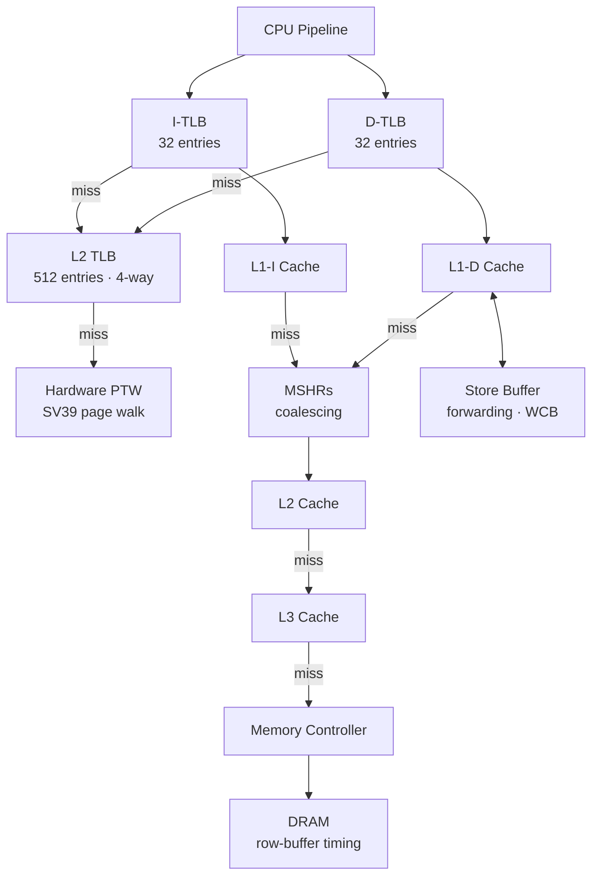

# Memory Hierarchy

rvsim models a complete memory hierarchy from TLBs through L3 cache to DRAM, with configurable parameters at every level.

## Overview

## Virtual Memory (SV39)

The simulator implements the RISC-V SV39 page translation scheme:

- **39-bit virtual addresses** with three levels of page tables (VPN[2], VPN[1], VPN[0])
- **4KB base pages**, 2MB megapages, 1GB gigapages
- **Separate iTLB and dTLB** — fully associative, configurable size (default: 32 entries each)
- **Shared L2 TLB** — set-associative (default: 512 entries, 4-way), accessed on iTLB/dTLB miss
- **Hardware page table walker** — walks the page table on L2 TLB miss, manages accessed (A) and dirty (D) bits

The TLB hierarchy is bypassed when `satp.MODE = Bare` (no translation) or in M-mode without `mstatus.MPRV` set.

## Cache Hierarchy

### L1 Instruction Cache

Accessed by the Fetch1 stage. Configurable size, associativity, latency, and replacement policy. Supports hardware prefetching (typically next-line).

Invalidated by:

- `FENCE.I` instruction (deferred to commit, drains store buffer first)
- Inclusive L2 eviction back-invalidation (if inclusion policy is Inclusive)

### L1 Data Cache

Accessed by the Memory1 stage. The critical path for load-to-use latency.

**Non-blocking operation (MSHRs):** When `mshr_count > 0`, L1D misses allocate a Miss Status Holding Register. The load is parked in the MSHR, and the pipeline continues executing other instructions. Multiple misses to the same cache line are coalesced into a single MSHR entry. When the line arrives from L2/L3/DRAM, all waiting loads are woken up.

**Blocking operation (MSHRs = 0):** When `mshr_count = 0`, L1D misses stall the pipeline until the line arrives. This is simpler but prevents the O3 backend from exploiting memory-level parallelism.

### L2 / L3 Caches

Unified caches accessed on L1 miss. Each level has independent size, associativity, latency, replacement policy, and prefetcher configuration.

### Inclusion Policies

The relationship between L1 and L2 is configurable:

| Policy | Behavior | Trade-off |
|--------|----------|-----------|
| **NINE** (default) | No inclusion enforcement | Simple, no coherence traffic |
| **Inclusive** | L2 eviction back-invalidates matching L1 lines | Guarantees L2 is a superset of L1 |
| **Exclusive** | L1 eviction installs the line into L2 (swap) | Maximizes effective cache capacity |

## Store Buffer

The store buffer sits between the pipeline and L1D, holding stores that have executed but not yet committed.

- **Store-to-load forwarding** — when a load address matches a pending store in the buffer, the data is forwarded directly without accessing L1D. Supports full and partial overlap detection.
- **Speculative draining** — stores can begin draining to L1D before commit, improving throughput
- **Write-combining buffer (WCB)** — optional buffer that coalesces multiple stores to the same cache line before draining, reducing L1D write port pressure

## Hardware Prefetching

Each cache level can have an independent hardware prefetcher:

| Prefetcher | How it works |
|------------|-------------|
| **NextLine** | On any access, prefetch the next `degree` cache lines |
| **Stride** | PC-indexed table detects constant-stride access patterns |
| **Stream** | Detects sequential access streams and prefetches ahead |
| **Tagged** | Prefetch-on-prefetch: a prefetched line triggers further prefetches |

A shared **prefetch deduplication filter** prevents redundant requests across levels.

## DRAM Controller

When all cache levels miss, the request reaches the memory controller:

**Simple controller** — fixed latency for all accesses.

**DRAM controller** — models row-buffer aware timing:

- **Row hit**: access costs `t_cas` cycles (column access to an already-open row)
- **Row miss**: access costs `row_miss_latency` cycles (precharge + row activate + column access)
- **Bank interleaving**: addresses are distributed across banks; accesses to different banks can overlap
- **Refresh**: periodic refresh cycles (`t_refi` / `t_rfc`) temporarily block accesses

The DRAM controller maintains per-bank row buffer state, so the actual latency of an access depends on whether the target row is already open.
