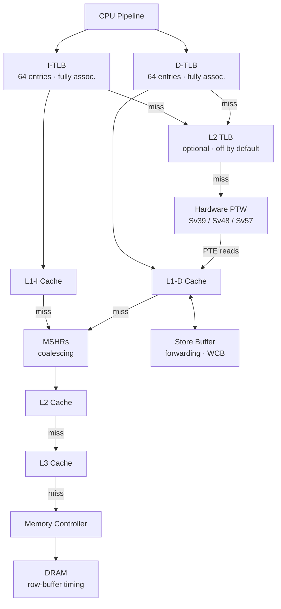

# Memory Hierarchy

rvsim models a complete memory hierarchy from TLBs through L3 cache to DRAM, with configurable parameters at every level. Every cache, the bus and the memory controller is an event-driven component exchanging request and response packets, so each access pays the latency and waits for the occupancy of every component it passes. Caches hold tags and coherence state only; data lives in one memory image and an access takes effect where it is served ([decision 11](decisions/0011-accesses-take-effect-where-they-are-served.md)).

## Overview

```mermaid
flowchart TD
    CPU["CPU Pipeline"] --> ITLB["I-TLB\n64 entries · fully assoc."] & DTLB["D-TLB\n64 entries · fully assoc."]
    ITLB --> L1I["L1-I Cache"]
    DTLB --> L1D["L1-D Cache"]
    ITLB & DTLB -->|miss| L2TLB["L2 TLB\noptional · off by default"]
    L2TLB -->|miss| PTW["Hardware PTW\nSv39 / Sv48 / Sv57"]
    PTW -->|PTE reads| L1D
    L1I & L1D -->|miss| MSHR["MSHRs\ncoalescing"]
    MSHR --> L2["L2 Cache"]
    L2 -->|miss| L3["L3 Cache"]
    L3 -->|miss| MC["Memory Controller"]
    MC --> DRAM["DRAM\nrow-buffer timing"]
    L1D <--> STB["Store Buffer\nforwarding · WCB"]
```

## Virtual Memory

The MMU implements the RISC-V Sv39, Sv48 and Sv57 paging modes, with
three, four and five levels of page table. `paging_mode_max` caps the
modes `satp` accepts: writing a stronger mode leaves `satp` reading back
as Bare, which is how a kernel probes for the deepest mode and falls back.

- **Pages.** 4 KiB base pages and every superpage size the mode allows
  (2 MiB, 1 GiB, 512 GiB, 256 TiB). A TLB entry maps a whole page of the
  size its leaf was found at, so a 2 MiB kernel mapping is one entry.
- **L1 TLBs.** Separate instruction and data TLBs of `tlb_size` entries
  (default 64), fully associative when `tlb_ways` is 0 (the default, as
  gem5's RISC-V TLB) and LRU within a set otherwise.
- **L2 TLB.** An optional TLB shared by the core's instruction and data
  sides (`l2_tlb_size`, `l2_tlb_ways`), hitting after `l2_tlb_latency`
  cycles. It is off by default, as gem5 has none.
- **Page-table walker.** A miss in every TLB starts a hardware walk. Each
  level's PTE is an 8-byte read sent to the L1D, so page-table entries are
  cached like data and a walk's cost depends on where they are found.
  Superpage alignment, reserved bits, the U, SUM and MXR rules and the
  PMP check on each PTE are all applied.
- **Accessed and dirty bits.** By default a page whose A bit, or D bit on
  a store, is clear raises a page fault and the kernel sets the bit
  (Svade). With `svadu=True` and `menvcfg.ADUE` set, the walker sets the
  bit itself and writes the updated PTE back (Svadu).
- **Flushes.** `SFENCE.VMA` flushes the TLBs at commit, by address and
  ASID when it names them.

Translation is skipped when `satp.MODE` is Bare or the hart runs in M-mode
(with `mstatus.MPRV` clear for loads and stores).

## Cache Hierarchy

### L1 Instruction Cache

Accessed by the Fetch1 stage. Configurable size, associativity, latency, and replacement policy. Supports hardware prefetching (typically next-line).

Invalidated by:

- `FENCE.I` instruction (deferred to commit, drains store buffer first)
- Inclusive L2 eviction back-invalidation (if inclusion policy is Inclusive)

### L1 Data Cache

Accessed by the Memory1 stage. The critical path for load-to-use latency.
An atomic (AMO) is one access: the cache takes the line writable, the
read-modify-write is performed on it and it is left modified, so commit
has no separate store to send.

### Every level: MSHRs, writeback buffer, blocking

Each cache level is one event-driven component, modelled after gem5's
classic cache:

- A **miss allocates an MSHR** and sends one line-sized request to the
  next level after the tag-lookup latency. A second miss to a line already
  in flight **joins that MSHR** instead of fetching again; when the fill
  arrives every joined request is answered at once. `mshr_count` bounds the
  fetches in flight (default 8; `mshr_count=1` gives a blocking cache,
and `0` from Python leaves the default).
  An MSHR holds at most `targets_per_mshr` requests (gem5's
  `tgts_per_mshr`, default 20): the request that fills it blocks the
  cache until that line's fill returns.
- A **write miss allocates**: the line is fetched, then installed dirty. A
  line written back from above merges into a held line or is forwarded
  without allocating.
- **A hart's access takes effect where it is served**, as gem5's cache
  satisfies a request. The caches hold tags only; the data lives in one
  memory image, and a load reads it, a store writes it, when the first
  cache holding the line with the permission the access needs serves the
  request: a hit as it arrives, a miss when its fill does. A request no
  cache serves takes effect at the memory controller. Line fills and
  writebacks between levels move permission and timing only.
- A **fill** is forwarded to every request the MSHR gathered as it is
  written into the array, `response_latency` cycles after it arrives
  (gem5's `response_latency`, default 1), rather than after a second array
  access.
- A fill that evicts a **dirty victim** puts it in the **writeback buffer**
  and sends it to the next level; the entry is freed when that level
  acknowledges. Dirty lines leaving the last cache reach the memory
  controller as writes, so DRAM sees the real write traffic.
- While every MSHR or every writeback buffer entry (`write_buffers`,
  default 8) is busy, or one MSHR holds its target limit, the cache is
  **blocked**: new requests queue in
  arrival order and are retried as entries free up, which is what a blocked
  port does to its requester.
- **Prefetches are real fetches**: a candidate line the prefetcher wants
  takes an MSHR (never the last free one) and travels down the hierarchy
  like a demand miss; a demand miss that joins it counts as a useful
  prefetch.

Per-level counters live under `core<N>.cache.{l1i,l1d,l2}` and `llc`:
`hits`, `misses`, `mshr_hits`, `blocked_requests`, `fills`, `evictions`,
`writebacks`, `back_invalidations`, `prefetches.issued`,
`prefetches.useful` and the derived `miss_rate`.

A load's dependents wake when its data returns: one cycle of address
generation plus the L1D's `latency` on a hit, or whenever the fill
arrives on a miss. Neither backend issues dependents speculatively on a
predicted hit.

### L2 / L3 Caches

Unified caches accessed on L1 miss. Each level has independent size, associativity, latency, replacement policy, and prefetcher configuration.

### Inclusion Policies

The relationship between adjacent levels is configurable:

| Policy | Behavior | Trade-off |
|--------|----------|-----------|
| **NINE** (default) | No inclusion enforcement | Simple, no back-invalidation traffic |
| **Inclusive** | An eviction back-invalidates the same line in the caches above; a dirty copy above is written back first | Guarantees each level is a superset of the levels above it, which a snooping lower level needs |
| **Exclusive** | L1 victims (clean or dirty) are handed to the L2; the L2 gives up its copy when it fills an L1 | Maximizes effective L1+L2 capacity; the LLC stays non-inclusive |

## Store Buffer

The store buffer sits between the pipeline and L1D, holding stores that have executed but not yet committed.

- **Store-to-load forwarding** — when a load address matches a pending store in the buffer, the data is forwarded directly without accessing L1D. Supports full and partial overlap detection.
- **Commit-time draining** — a store is written to L1D only after it commits, one per cycle from the head of the buffer, and keeps its slot (and keeps forwarding) until the L1D has performed it and acknowledged
- **Write-combining buffer (WCB)** — optional merging write buffer (`wcb_entries`) between the store buffer and the L1D. A committed store merges into the entry for its line, which the hart's loads read from; the entry is written to the L1D as one masked line write when a new line needs its slot, when its line is fully written, when a load needs bytes it holds only some of, or when the store buffers leave the write port idle. A sent line keeps forwarding until the L1D acknowledges its write, since the cache can still serve a load from its old copy of the line while it fetches write permission. Barriers wait for its lines like any other committed store

## Cache-block operations

`cbo.clean`, `cbo.flush` and `cbo.inval` (Zicbom) and `cbo.zero` (Zicboz)
act on a 64-byte block, which every cache line must hold whole. A CBO
translates in memory1 and takes a store-buffer slot, so it drains to the
L1D in order with the stores around it after it commits, and barriers wait
for it like a store.

- `cbo.zero` is the hart's write of a zeroed block, taking effect where the
  L1D serves it.
- The management operations follow gem5's `CleanSharedReq`,
  `CleanInvalidReq` and `InvalidateReq` to the point of coherence: each
  cache on the way applies the operation to its copy (a clean keeps the
  line clean, a flush or invalidate drops it and the inclusive copies above
  it) and passes it on, carrying any dirty data it found, which an
  invalidate discards. A coherent L2 sends the home agent a maintenance
  request; the home snoops the other harts (the owner is cleaned for a
  clean, every holder invalidated for a flush, dropped without its data for
  an invalidate), passes the operation to the LLC, and completes the
  requester once memory acknowledges it. The memory controller counts a
  line write when dirty data arrives with it.
- Because caches hold tags only, an invalidate cannot lose data: memory
  keeps the latest value, which the specification allows since
  `cbo.inval` may perform a flush.
- Device regions do not support CBOs: every CBO, `cbo.zero` included, to a
  device address raises a store access fault.

## Hardware Prefetching

Each cache level can have an independent hardware prefetcher:

| Prefetcher | How it works |
|------------|-------------|
| **NextLine** | On any access, prefetch the next `degree` cache lines |
| **Stride** | A `table_size`-entry table, indexed by the accessed line address (no PC reaches the cache), records the last address and stride; after the same stride repeats three times it prefetches `degree` strides ahead. Strides of a line or more train only when they alias back to one entry (#102) |
| **Stream** | Detects ascending or descending runs of consecutive lines and prefetches `degree` lines ahead in that direction |
| **Tagged** | Prefetches the next line on a demand miss, and again when a demand access first uses a prefetched line, so a useful stream keeps extending |

The prefetcher sees every demand access to its cache. A candidate is
dropped when its line is already present, already being fetched or being
written back, so no level fetches a line twice; each level's prefetcher
works independently.

## DRAM Controller

Three memory controllers are available; all sit behind the L3 (or the last
enabled cache level) and the system bus.

**Simple controller** (the default) — every access takes `latency` cycles
(120 by default) once the controller is free: each request busies it for the time its bytes take
at `bandwidth_gib_s` (gem5's `SimpleMemory`), and later requests wait.

**DRAM controller** — models row-buffer aware timing over 8 banks of
2 KiB rows:

- **Row hit**: `t_cas` cycles (a column access to the open row)
- **Closed bank**: `t_ras + t_cas` (activate, then the column access)
- **Row conflict**: `t_pre + t_ras + t_cas` (precharge the open row, activate, access)
- **Bank interleaving**: consecutive rows map to different banks, and accesses to different banks overlap; two activates are at least 4 cycles apart (tRRD)
- **Refresh**: every 7,800 cycles all banks close their rows and are busy for 350 cycles

### DDR5 Controller

`MemoryController.DDR5()` is a command-level model of a DDR5 memory
subsystem in the style of gem5's `MemCtrl` / `DRAMInterface`. Every request
becomes a sequence of JEDEC commands scheduled against per-bank state, and
every command must clear the timing constraints of JESD79-5B.

**Clock domain.** The controller runs at the DRAM command clock (data rate
/ 2, so 2400 MHz for DDR5-4800). Requests arrive stamped with the core cycle
and are converted through `cpu_clock_mhz`; responses are converted back. Set
`cpu_clock_mhz` to the core you are modelling; the default 2400 MHz gives a
1:1 ratio with DDR5-4800.

**Topology.** `channels` × two sub-channels (each with its own command and
32-bit data bus) × `ranks_per_channel` × `bank_groups_per_rank` ×
`banks_per_group`. Physical addresses are split into these coordinates by
the `address_mapping` interleave; rows are `64 << column_bits` bytes.

**Timing.** A speed bin (`4800B`, `5600B`) carries each JEDEC parameter as
"the larger of N clocks and T ns" and resolves it for the bin's clock,
rounding up as the standard does. Enforced per command: tRCD, tRP, tRAS,
tRC, tRRD_S/L, tCCD_S/L, tCCD_L_WR, tFAW (four-activate window per rank),
tWTR_S/L, tWR, tRTP, tPPD, tRTRS (rank switch on the data bus), the
read-to-write bus turnaround, CL / CWL and the BL16 burst. ACT, RD and WR
occupy the command bus for two clocks, PRE and REF for one. Any field can be
overridden with `timing={...}`.

**Queues and scheduling.** Reads and writes have separate bounded queues
(64 entries each); requests wait for admission in arrival order. Writes are
posted: acknowledged when queued and drained later, once the write queue
crosses its high watermark or when there are no reads, for at least
`min_writes_per_switch` writes. A write to a line already queued merges into
it; a read to a line in the write queue is answered from the queue. Reads
pay the fixed front-end and back-end latencies (10 ns each) on top of the
DRAM access. The scheduler is FR-FCFS by default: an open-row hit that can
issue now wins, otherwise the request that becomes ready soonest; `Fcfs`
keeps arrival order.

**Refresh.** `AllBank` issues `REFab` every tREFI: the rank stops taking
commands, open rows close with a PRECHARGE-ALL, REFRESH issues after tRP,
and the rank is busy for tRFC1. `SameBank` issues `REFsb` every
tREFI / banks-per-group, rotating through the bank sets so only one bank
per bank group is busy (for tRFCsb) while the rest of the rank keeps
serving.

**Power-down.** With `power_down_idle_ns`, a rank with no command, no burst
in flight and no queued request for that long enters precharge or active
power-down, and pays tXP after the exit command before its next command.

**ECC.** `SecDed` and `ChipKill` do not change DRAM timing; with
`patrol_scrub_ns` they add a background scrubber that reads every line in
address order at that rate.

**Statistics** live under `memctrl0.ch<C>.sc<S>`: `reads`, `writes`,
`writes_merged`, `reads_hit_write_queue`, `scrub_reads`, `activates`,
`precharges`, `precharge_alls`, `refreshes`, `row_hits`, `row_misses`,
`row_hit_rate`, `power_down_entries`, `power_down_exits`, `bus_busy_clocks`,
`clocks`, `data_bus_utilization`, `read_admission_stalls`,
`write_admission_stalls`, and the histograms `read_latency`,
`read_queue_depth`, `write_queue_depth`. Per-bank counters sit under
`rank<R>.bank<B>` and are queryable but omitted from the summary.
