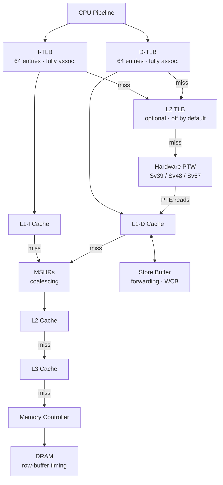
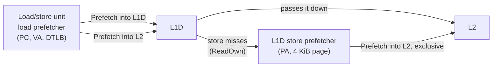

# Memory Hierarchy

rvsim models a complete memory hierarchy from TLBs through L3 cache to DRAM, with configurable parameters at every level. Every cache, the bus and the memory controller is an event-driven component exchanging request and response packets, so each access pays the latency and waits for the occupancy of every component it passes. Caches hold tags and coherence state only; data lives in one memory image and an access takes effect where it is served ([decision 11](decisions/0011-accesses-take-effect-where-they-are-served.md)).

## Overview

```mermaid
flowchart TD
    CPU["CPU Pipeline"] --> ITLB["I-TLB\n64 entries · fully assoc."] & DTLB["D-TLB\n64 entries · fully assoc."]
    ITLB --> L1I["L1-I Cache"]
    DTLB --> L1D["L1-D Cache"]
    ITLB & DTLB -->|miss| L2TLB["L2 TLB\noptional · off by default"]
    L2TLB -->|miss| PTW["Hardware PTW\nSv39 / Sv48 / Sv57"]
    PTW -->|PTE reads| L1D
    L1I & L1D -->|miss| MSHR["MSHRs\ncoalescing"]
    MSHR --> L2["L2 Cache"]
    L2 -->|miss| L3["L3 Cache"]
    L3 -->|miss| MC["Memory Controller"]
    MC --> DRAM["DRAM\nrow-buffer timing"]
    L1D <--> STB["Store Buffer\nforwarding · WCB"]
```

## Virtual Memory

The MMU implements the RISC-V Sv39, Sv48 and Sv57 paging modes, with
three, four and five levels of page table. `paging_mode_max` caps the
modes `satp` accepts: writing a stronger mode leaves `satp` reading back
as Bare, which is how a kernel probes for the deepest mode and falls back.

- **Pages.** 4 KiB base pages and every superpage size the mode allows
  (2 MiB, 1 GiB, 512 GiB, 256 TiB). A TLB entry maps a whole page of the
  size its leaf was found at, so a 2 MiB kernel mapping is one entry.
- **L1 TLBs.** Separate instruction and data TLBs of `tlb_size` entries
  (default 64), fully associative when `tlb_ways` is 0 (the default, as
  gem5's RISC-V TLB) and LRU within a set otherwise.
- **L2 TLB.** An optional TLB shared by the core's instruction and data
  sides (`l2_tlb_size`, `l2_tlb_ways`), hitting after `l2_tlb_latency`
  cycles. It is off by default, as gem5 has none.
- **Page-table walker.** A miss in every TLB starts a hardware walk. Each
  level's PTE is an 8-byte read sent to the L1D, so page-table entries are
  cached like data and a walk's cost depends on where they are found.
  Superpage alignment, reserved bits, the U, SUM and MXR rules and the
  PMP check on each PTE are all applied.
- **Accessed and dirty bits.** By default a page whose A bit, or D bit on
  a store, is clear raises a page fault and the kernel sets the bit
  (Svade). With `svadu=True` and `menvcfg.ADUE` set, the walker sets the
  bit itself and writes the updated PTE back (Svadu).
- **Flushes.** `SFENCE.VMA` flushes the TLBs at commit, by address and
  ASID when it names them.

Translation is skipped when `satp.MODE` is Bare or the hart runs in M-mode
(with `mstatus.MPRV` clear for loads and stores).

## Cache Hierarchy

### L1 Instruction Cache

Accessed by the Fetch1 stage. Configurable size, associativity, latency, and replacement policy. Supports hardware prefetching (typically next-line).

Invalidated by:

- `FENCE.I` instruction (deferred to commit, drains store buffer first)
- Inclusive L2 eviction back-invalidation (if inclusion policy is Inclusive)

**Coherence with the L1D.** The L1I refills from below, so a line the L1D
holds dirty must reach the refill. How depends on the hierarchy, as it
does in hardware:

- **With an L2**, where the L1I's and L1D's paths join, the L2 keeps
  instruction fetches coherent. An instruction fetch for a line the L2
  gave the L1D writable (or, exclusive, handed up) first probes the L1D,
  which writes the line back if it is dirty and keeps it clean; the fetch
  is served once the L1D answers (`l2.fetch_probes`,
  `l2.fetch_probes_dirty`). This is what the coherent, inclusive L2s of
  SiFive's U74 and of Rocket do; FENCE.I then only invalidates the L1I. A
  non-inclusive L2 that has evicted the line has no record of an L1D copy
  (it has no snoop filter), so such a fetch is not probed.
- **Without an L2**, nothing keeps them coherent, so FENCE.I flushes the
  L1D first, as Rocket does when no coherence manager tracks its cached
  executable memory (`M_FLUSH_ALL`). At the ROB head it asks the L1D to
  walk every line, one a cycle: a dirty line is written back through the
  writeback buffer (whose capacity bounds the writebacks in flight), and
  every valid line is invalidated, a clean one silently since nothing
  below records it. FENCE.I retires once the last writeback is
  acknowledged (`l1d.flushes`, `l1d.flushed_lines`). The L1D takes no
  other request during the walk, and the data it held misses afterwards.
  Like Rocket's `flushed` bit, the L1D skips the walk when it has fetched
  nothing since its last flush, and a FENCE.I arriving during a flush
  waits for that flush rather than starting another.

### L1 Data Cache

Accessed by the Memory1 stage. The critical path for load-to-use latency.
An atomic (AMO) is one access: the cache takes the line writable, the
read-modify-write is performed on it and it is left modified, so commit
has no separate store to send.

### Every level: MSHRs, writeback buffer, blocking

Each cache level is one event-driven component, modelled after gem5's
classic cache:

- A **miss allocates an MSHR** and sends one line-sized request to the
  next level after the tag-lookup latency. A second miss to a line already
  in flight **joins that MSHR** instead of fetching again; when the fill
  arrives every joined request is answered at once. `mshr_count` bounds the
  fetches in flight (default 8; `mshr_count=1` gives a blocking cache,
  and 0 is refused).
  An MSHR holds at most `targets_per_mshr` requests (gem5's
  `tgts_per_mshr`, default 20): the request that fills it blocks the
  cache until that line's fill returns.
- A **write miss allocates**: the line is fetched, then installed dirty. A
  line written back from above merges into a held line or is forwarded
  without allocating.
- **A hart's access takes effect where it is served**, as gem5's cache
  satisfies a request. The caches hold tags only; the data lives in one
  memory image, and a load reads it, a store writes it, when the first
  cache holding the line with the permission the access needs serves the
  request: a hit as it arrives, a miss when its fill does. A request no
  cache serves takes effect at the memory controller. Line fills and
  writebacks between levels move permission and timing only.
- A **fill** is forwarded to every request the MSHR gathered as it is
  written into the array, `response_latency` cycles after it arrives
  (gem5's `response_latency`, default 1), rather than after a second array
  access.
- A fill that evicts a **dirty victim** puts it in the **writeback buffer**
  and sends it to the next level; the entry is freed when that level
  acknowledges. A fill whose dirty victim finds the buffer full waits,
  holding its MSHR, until a writeback is acknowledged, as a real core's
  linefill does. A dirty line a probe or back-invalidation demands goes
  back on the snoop-response path and takes no buffer slot. Dirty lines
  leaving the last cache reach the memory controller as writes, so DRAM
  sees the real write traffic.
- While every MSHR or every writeback buffer entry (`write_buffers`,
  default 8) is busy, or one MSHR holds its target limit, the cache is
  **blocked**: new requests queue in
  arrival order and are retried as entries free up, which is what a blocked
  port does to its requester.
- **Prefetches are real fetches**: a candidate line the prefetcher wants
  takes an MSHR (never the last free one) and travels down the hierarchy
  like a demand miss. A request that joins it in flight makes it late;
  the first request to find its line once installed makes it useful;
  its line dropped before any request found it makes it unused.

Per-level counters live under `core<N>.cache.{l1i,l1d,l2}` and `llc`:
`hits`, `misses`, `mshr_hits`, `blocked_requests`, `fills`, `evictions`,
`writebacks`, `back_invalidations`, `prefetches.issued`,
`prefetches.late`, `prefetches.useful`, `prefetches.unused`, and the
derived `prefetches.used`, `prefetches.accuracy` and `miss_rate`.

A load's dependents wake when its data returns: one cycle of address
generation plus the L1D's `latency` on a hit, or whenever the fill
arrives on a miss. Neither backend issues dependents speculatively on a
predicted hit.

### L2 / L3 Caches

Unified caches accessed on L1 miss. Each level has independent size, associativity, latency, replacement policy, and prefetcher configuration.

### Inclusion Policies

The relationship between adjacent levels is configurable:

| Policy | Behavior | Trade-off |
|--------|----------|-----------|
| **NINE** (default) | No inclusion enforcement | Simple, no back-invalidation traffic |
| **Inclusive** | An eviction back-invalidates the same line in the caches above; a dirty copy above is written back first | Guarantees each level is a superset of the levels above it, which a snooping lower level needs |
| **Exclusive** | L1 victims (clean or dirty) are handed to the L2; the L2 gives up its copy when it fills an L1 | Maximizes effective L1+L2 capacity; the LLC stays non-inclusive |

An exclusive L2 keeps a shadow tag for each line it handed up without
keeping, so it neither prefetches a line held above nor loses track of
it: the line comes back as a victim, or the tag is dropped when the line
is flushed or invalidated from above.

### Invariant audit

`Simulator::set_audit_caches(true)` (Python: `sim.audit_caches = True`)
checks every cache invariant after every event: no duplicate tags, MSHRs
or writebacks, no MSHR over its target limit, no more MSHRs or eviction
writebacks than the cache has entries, inclusion as each level's policy
sets it, every copy above a level recorded by it, and, with several cores,
the coherence invariants. Lines with a request, fill, probe or writeback
in flight are left out of the cross-level checks. The first broken
invariant ends `tick()` with `SimError::CacheInvariant`;
`Simulator::cache_violations` lists them all. The audit walks every cache
after each event, so it is off by default and costs nothing then.

## Store Buffer

The store buffer sits between the pipeline and L1D, holding stores that have executed but not yet committed.

- **Store-to-load forwarding** — when a load address matches a pending store in the buffer, the data is forwarded directly without accessing L1D. Supports full and partial overlap detection. A load from a device never forwards: a register need not read back what was written to it, and the read has side effects. It waits until it was the oldest instruction as the cycle began, so at the earliest the cycle after the instruction ahead of it retires, and every older store to its bytes has been written, then reads the device; other device stores do not hold it, as RVWMO orders only same-address accesses without a FENCE.
- **Commit-time draining** — a store is written to L1D only after it commits, one per cycle from the head of the buffer, and keeps its slot (and keeps forwarding) until the L1D has performed it and acknowledged
- **Write-combining buffer (WCB)** — optional merging write buffer (`wcb_entries`) between the store buffer and the L1D. A committed store merges into the entry for its line, which the hart's loads read from; the entry is written to the L1D as one masked line write when a new line needs its slot, when its line is fully written, when a load needs bytes it holds only some of, or when the store buffers leave the write port idle. A sent line keeps forwarding until the L1D acknowledges its write, since the cache can still serve a load from its old copy of the line while it fetches write permission. Barriers wait for its lines like any other committed store

## Cache-block operations

`cbo.clean`, `cbo.flush` and `cbo.inval` (Zicbom) and `cbo.zero` (Zicboz)
act on a 64-byte block, which every cache line must hold whole. A CBO
translates in memory1 and takes a store-buffer slot, so it drains to the
L1D in order with the stores around it after it commits, and barriers wait
for it like a store.

- `cbo.zero` is the hart's write of a zeroed block, taking effect where the
  L1D serves it.
- The management operations follow gem5's `CleanSharedReq`,
  `CleanInvalidReq` and `InvalidateReq` to the point of coherence: each
  cache on the way applies the operation to its copy (a clean keeps the
  line clean, a flush or invalidate drops it and the inclusive copies above
  it) and passes it on, carrying any dirty data it found, which an
  invalidate discards. A coherent L2 sends the home agent a maintenance
  request; the home snoops the other harts (the owner is cleaned for a
  clean, every holder invalidated for a flush, dropped without its data for
  an invalidate), passes the operation to the LLC, and completes the
  requester once memory acknowledges it. The memory controller counts a
  line write when dirty data arrives with it.
- Because caches hold tags only, an invalidate cannot lose data: memory
  keeps the latest value, which the specification allows since
  `cbo.inval` may perform a flush.
- Device regions do not support CBOs: every CBO, `cbo.zero` included, to a
  device address raises a store access fault.

## Hardware Prefetching

Prefetchers sit where the hardware puts them and know only what it knows
there ([decision 14](decisions/0014-prefetchers-follow-published-hardware.md)).
The design follows the Cortex-A72's load/store hardware prefetcher, the
one core in the presets whose prefetchers are documented: Arm, *Cortex-A72
MPCore Processor Technical Reference Manual* r0p3, §6.4.9 (load/store
hardware prefetcher), §4.3.66 (`CPUACTLR_EL1`) and §4.3.67
(`CPUECTLR_EL1`); and on Intel's description of its prefetchers in the
*64 and IA-32 Architectures Optimization Reference Manual* Vol. 1
(248966-049), §9.5.2 and §4.1.7. What follows says, for each part, which
behaviour comes from those manuals and which is rvsim's own choice.

```mermaid
flowchart LR
    LSU["Load/store unit<br/>load prefetcher<br/>(PC, VA, DTLB)"] -- "Prefetch into L1D" --> L1D
    LSU -- "Prefetch into L2" --> L1D
    L1D -- "passes it down" --> L2
    L1D -- "store misses<br/>(ReadOwn)" --> SP["L1D store prefetcher<br/>(PA, 4 KiB page)"]
    SP -- "Prefetch into L2, exclusive" --> L2
```

Each cache may also run a cache-side prefetcher of its own on the physical
addresses it sees.

### Prefetch requests

A prefetch travels as a `MemReq` with `MemOp::Prefetch { into, exclusive }`
from the load/store unit or the L1D. Caches above `into` pass it down
unchanged; the cache at `into` starts a prefetch fetch of the line unless
it already holds it (with write permission, for an exclusive prefetch),
is already fetching it or is writing it back. Nothing answers a prefetch.
A cache drops one rather than give up its last free MSHR
(`prefetches.dropped`), so prefetches never block demand misses, and a
disabled level passes on prefetches meant for the level below it and
drops its own.

### Load prefetcher (load/store unit)

Configured with `Config(load_prefetcher=LoadPrefetcher.Stride(...))`.

- **Where it trains.** In memory1, on every load that goes to the memory
  system, whether the L1D or store-buffer forwarding answers it: scalar
  loads, vector spans and vector elements. It sees the load's PC, its
  virtual address and its physical address. A load that waits to retry
  does not train until it goes. *(Source: the A72's prefetcher is part of
  the load/store unit, §6.4.9.)*
- **How it detects streams.** A reference prediction table of
  `table_size` entries, direct-mapped and tagged on the load's PC, holds
  each load's last virtual address, stride and a 2-bit saturating
  confidence. A repeated stride raises the confidence; a different one
  lowers it, and replaces the stride once it reaches zero. A stream is
  confident once the same nonzero stride has followed a saturated
  confidence, that is from a load's sixth access at one stride. A load
  whose PC maps to another load's entry takes it over. *(rvsim's choice:
  neither manual describes the detection algorithm; this is Chen and
  Baer's reference prediction table, as gem5's `StridePrefetcher` uses.
  The cache-side stride prefetcher shares the same rule.)*
- **How far ahead.** A confident stream keeps `l1_lines` lines ahead of
  the demand access in the L1D and, beyond them, `l2_lines` lines ahead in
  the L2 alone. Each line is requested once: a stream remembers the
  furthest line it has requested at each level, and starts again when the
  load leaves that window (a second pass over the same array). *(Source
  for the L2 distance: `CPUECTLR_EL1[33:32]`, "the number of requests by
  which the prefetch request to the L2, on a load stream, is ahead of the
  demand request stream", 16 to 22, reset 22. The L1D distance is not
  published.)*
- **Line granularity.** Prefetches go out a line at a time, so a stride
  shorter than a line advances one line per prefetch rather than naming
  the line the load is already in, and a longer stride names the line it
  lands in.
- **Page boundaries.** `page_boundary=PageBoundary.Stop()` keeps every
  prefetch in the page of the load that trained it. The page's size comes
  from the data TLB's entry for it (4 KiB, 2 MiB, 1 GiB...), and is 4 KiB
  when translation is off or the entry has gone. `PageBoundary.CrossWithTlb()`
  continues into the next page when the data TLB already holds its
  translation, looked up without disturbing the TLB's replacement state
  and without starting a walk; on a miss the prefetch is dropped. With
  translation off the address is physical and crossing needs no lookup.
  *(Source: `CPUACTLR_EL1[43]` — reset 0, "Enables the Load/Store hardware
  prefetcher to use VA in generating prefetches that can cross page
  boundaries"; set, "prefetch is restricted to within the page boundary
  of the demand request". Intel's Gracemont prefetcher crosses pages in
  the linear address space and "start[s] translations for TLB misses";
  rvsim drops instead, as the A72 manual does not say it walks.)*
- **What it may touch.** A prefetch whose page the load could not read
  (permissions, `mstatus.SUM`/`MXR`, PMP at the load's effective
  privilege) or whose line is not RAM is dropped, so a prefetch never
  reaches a device.
- **Where a level stops.** A level stops at its first line it cannot
  place and picks up from that line on the load's next access.

Stats under `core<N>.prefetch.loads`: `l1` and `l2` (prefetches sent to
fill each level) and `dropped.page_boundary`, `dropped.tlb_miss`,
`dropped.denied`, `dropped.not_ram`.

### Store prefetcher (L1D)

Configured with `Config(store_prefetcher=StorePrefetcher.Stream(...))`.
It watches the L1D's store misses that start a fetch for write permission
(`ReadOwn`, the `ReadUnique` of the coherence protocol), finds runs of
misses to adjacent lines inside one 4 KiB physical page, tracking
`streams` runs at once, and once a run has gone two lines in one direction
keeps it `l2_lines` lines ahead with exclusive prefetches into the L2,
each line once. `prefetches.store_stream` on the L1D counts them.
*(Source: §6.4.9, "Prefetching on store accesses is managed by a PA based
prefetcher and only prefetches to the L2 cache", and `CPUACTLR_EL1[42]`,
prefetch requests "generated by ReadUnique transactions". The run
detection and its length are rvsim's choice. Stores drain after commit as
merged lines with no translation attached, so the prefetcher keeps to the
smallest page.)*

### Cache-side prefetchers

Each cache level can also have a prefetcher of its own
(`Cache(prefetcher=...)`). A cache sees physical addresses only, and the
physical page after the one an access touches may belong to anything, so
like a hardware PA prefetcher it drops every candidate outside the 4 KiB
page of the access that produced it (`prefetches.page_crossing`). *(Source:
Intel, "it will not prefetch across a 4-KByte page boundary"; the A72's
PA mode keeps to the page.)*

| Prefetcher | How it works |
|------------|-------------|
| **NextLine** | On any access, prefetch the next `degree` cache lines |
| **Stride** | The reference prediction table above, kept in the cache: demand loads and fetches carry their PC to the cache, and stores, page walks and writebacks do not, so they do not train it. A confident stream prefetches the next `degree` lines along its stride, a line at a time. gem5's `StridePrefetcher` is this design, and the gem5 comparison uses it |
| **Stream** | Detects ascending or descending runs of consecutive lines and prefetches `degree` lines ahead in that direction |
| **Tagged** | Prefetches the next line on a demand miss, and again when a demand access first uses a prefetched line, so a useful stream keeps extending |

The prefetcher sees every demand access to its cache. A candidate is
dropped when its line is already present, already being fetched or being
written back, so no level fetches a line twice, and when it would take the
last free MSHR; each level's prefetcher works independently.

### In the presets

| Preset | L1D prefetching |
|--------|-----------------|
| `cortex_a72()` | Load prefetcher, `l2_lines=22` and `CrossWithTlb` (the reset values of `CPUECTLR_EL1[33:32]` and `CPUACTLR_EL1[43]`); store prefetcher into the L2. The L1D distance (1 line), table size (32) and store run length (8 lines, 4 runs) are not published |
| `p550()` | SiFive has not published the P550's prefetchers: a load prefetcher that keeps to the page (`Stop`, 1 line ahead, no L2 stream) and no store prefetcher, as the cautious reading |
| `fast()`, `m1()`, `basic()` | The cache-side stride prefetcher on the L1D, as before; Apple's prefetchers are not published either |

## DRAM Controller

Three memory controllers are available; all sit behind the L3 (or the last
enabled cache level) and the system bus.

**Simple controller** (the default) — every access takes `latency` cycles
(120 by default) once the controller is free: each request busies it for the time its bytes take
at `bandwidth_gib_s` (gem5's `SimpleMemory`), and later requests wait.

**DRAM controller** — models row-buffer aware timing over 8 banks of
2 KiB rows:

- **Row hit**: `t_cas` cycles (a column access to the open row)
- **Closed bank**: `t_ras + t_cas` (activate, then the column access)
- **Row conflict**: `t_pre + t_ras + t_cas` (precharge the open row, activate, access)
- **Bank interleaving**: consecutive rows map to different banks, and accesses to different banks overlap; two activates are at least 4 cycles apart (tRRD)
- **Refresh**: every 7,800 cycles all banks close their rows and are busy for 350 cycles

### DDR5 Controller

`MemoryController.DDR5()` is a command-level model of a DDR5 memory
subsystem in the style of gem5's `MemCtrl` / `DRAMInterface`. Every request
becomes a sequence of JEDEC commands scheduled against per-bank state, and
every command must clear the timing constraints of JESD79-5B.

**Clock domain.** The controller runs at the DRAM command clock (data rate
/ 2, so 2400 MHz for DDR5-4800). Requests arrive stamped with the core cycle
and are converted through `cpu_clock_mhz`; responses are converted back. Set
`cpu_clock_mhz` to the core you are modelling; the default 2400 MHz gives a
1:1 ratio with DDR5-4800.

**Topology.** `channels` × two sub-channels (each with its own command and
32-bit data bus) × `ranks_per_channel` × `bank_groups_per_rank` ×
`banks_per_group`. Physical addresses are split into these coordinates by
the `address_mapping` interleave; rows are `64 << column_bits` bytes.

**Timing.** A speed bin (`4800B`, `5600B`) carries each JEDEC parameter as
"the larger of N clocks and T ns" and resolves it for the bin's clock,
rounding up as the standard does. Enforced per command: tRCD, tRP, tRAS,
tRC, tRRD_S/L, tCCD_S/L, tCCD_L_WR, tFAW (four-activate window per rank),
tWTR_S/L, tWR, tRTP, tPPD, tRTRS (rank switch on the data bus), the
read-to-write bus turnaround, CL / CWL and the BL16 burst. ACT, RD and WR
occupy the command bus for two clocks, PRE and REF for one. Any field can be
overridden with `timing={...}`.

**Queues and scheduling.** Reads and writes have separate bounded queues
(64 entries each); requests wait for admission in arrival order. Writes are
posted: acknowledged when queued and drained later, once the write queue
crosses its high watermark or when there are no reads, for at least
`min_writes_per_switch` writes. A write to a line already queued merges into
it; a read to a line in the write queue is answered from the queue. Reads
pay the fixed front-end and back-end latencies (10 ns each) on top of the
DRAM access. The scheduler is FR-FCFS by default: an open-row hit that can
issue now wins, otherwise the request that becomes ready soonest; `Fcfs`
keeps arrival order.

**Refresh.** `AllBank` issues `REFab` every tREFI: the rank stops taking
commands, open rows close with a PRECHARGE-ALL, REFRESH issues after tRP,
and the rank is busy for tRFC1. `SameBank` issues `REFsb` every
tREFI / banks-per-group, rotating through the bank sets so only one bank
per bank group is busy (for tRFCsb) while the rest of the rank keeps
serving.

**Power-down.** With `power_down_idle_ns`, a rank with no command, no burst
in flight and no queued request for that long enters precharge or active
power-down, and pays tXP after the exit command before its next command.

**ECC.** `SecDed` and `ChipKill` do not change DRAM timing; with
`patrol_scrub_ns` they add a background scrubber that reads every line in
address order at that rate.

**Statistics** live under `memctrl0.ch<C>.sc<S>`: `reads`, `writes`,
`writes_merged`, `reads_hit_write_queue`, `scrub_reads`, `activates`,
`precharges`, `precharge_alls`, `refreshes`, `row_hits`, `row_misses`,
`row_hit_rate`, `power_down_entries`, `power_down_exits`, `bus_busy_clocks`,
`clocks`, `data_bus_utilization`, `read_admission_stalls`,
`write_admission_stalls`, and the histograms `read_latency`,
`read_queue_depth`, `write_queue_depth`. Per-bank counters sit under
`rank<R>.bank<B>` and are queryable but omitted from the summary.
