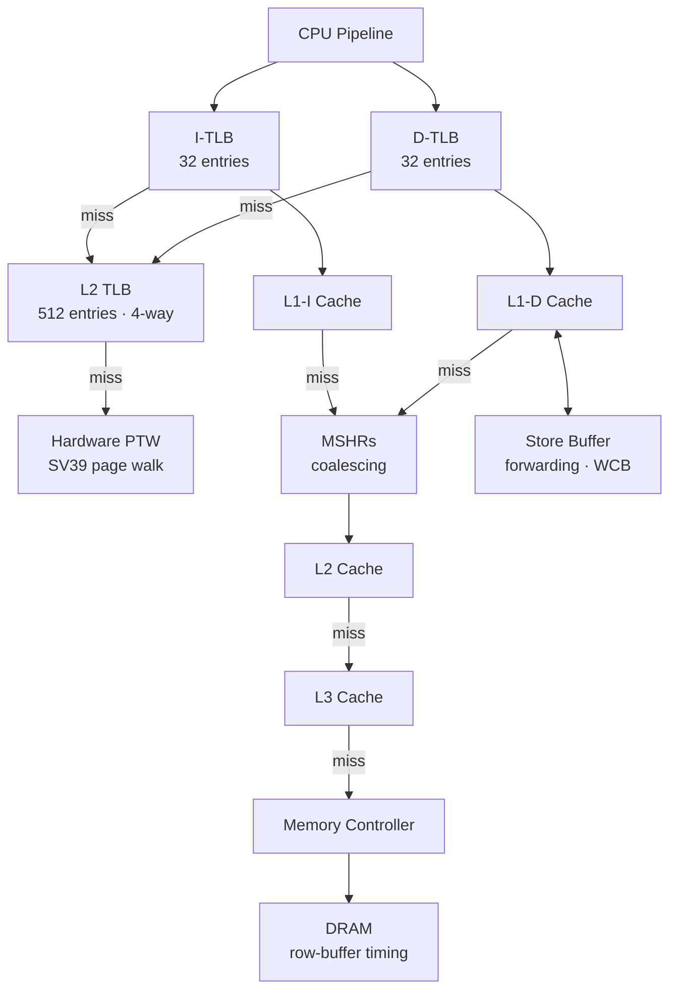

# Memory Hierarchy

rvsim models a complete memory hierarchy from TLBs through L3 cache to DRAM, with configurable parameters at every level.

## Overview

```mermaid
flowchart TD
    CPU["CPU Pipeline"] --> ITLB["I-TLB\n32 entries"] & DTLB["D-TLB\n32 entries"]
    ITLB --> L1I["L1-I Cache"]
    DTLB --> L1D["L1-D Cache"]
    ITLB & DTLB -->|miss| L2TLB["L2 TLB\n512 entries · 4-way"]
    L2TLB -->|miss| PTW["Hardware PTW\nSV39 page walk"]
    L1I & L1D -->|miss| MSHR["MSHRs\ncoalescing"]
    MSHR --> L2["L2 Cache"]
    L2 -->|miss| L3["L3 Cache"]
    L3 -->|miss| MC["Memory Controller"]
    MC --> DRAM["DRAM\nrow-buffer timing"]
    L1D <--> STB["Store Buffer\nforwarding · WCB"]
```

## Virtual Memory (SV39)

The simulator implements the RISC-V SV39 page translation scheme:

- **39-bit virtual addresses** with three levels of page tables (VPN[2], VPN[1], VPN[0])
- **4KB base pages**, 2MB megapages, 1GB gigapages
- **Separate iTLB and dTLB** — fully associative, configurable size (default: 32 entries each)
- **Shared L2 TLB** — set-associative (default: 512 entries, 4-way), accessed on iTLB/dTLB miss
- **Hardware page table walker** — walks the page table on L2 TLB miss, manages accessed (A) and dirty (D) bits

The TLB hierarchy is bypassed when `satp.MODE = Bare` (no translation) or in M-mode without `mstatus.MPRV` set.

## Cache Hierarchy

### L1 Instruction Cache

Accessed by the Fetch1 stage. Configurable size, associativity, latency, and replacement policy. Supports hardware prefetching (typically next-line).

Invalidated by:

- `FENCE.I` instruction (deferred to commit, drains store buffer first)
- Inclusive L2 eviction back-invalidation (if inclusion policy is Inclusive)

### L1 Data Cache

Accessed by the Memory1 stage. The critical path for load-to-use latency.
An atomic (AMO) is one access: the cache takes the line writable, the
read-modify-write is performed on it and it is left modified, so commit
has no separate store to send.

### Every level: MSHRs, writeback buffer, blocking

Each cache level is one event-driven component, modelled after gem5's
classic cache:

- A **miss allocates an MSHR** and sends one line-sized request to the
  next level after the tag-lookup latency. A second miss to a line already
  in flight **joins that MSHR** instead of fetching again; when the fill
  arrives every joined request is answered at once. `mshr_count` bounds the
  fetches in flight (default 8; zero behaves as one, a blocking cache).
- A **write miss allocates**: the line is fetched, then installed dirty. A
  whole-line write from above (a drained write-combining line, or a
  cache-maintenance writeback) merges into a held line or is forwarded
  without allocating.
- A **fill** answers every request the MSHR gathered after the cache's
  access latency: the line is read out of the array like a hit.
- A fill that evicts a **dirty victim** puts it in the **writeback buffer**
  and sends it to the next level; the entry is freed when that level
  acknowledges. Dirty lines leaving the last cache reach the memory
  controller as writes, so DRAM sees the real write traffic.
- While every MSHR or every writeback buffer entry (`write_buffers`,
  default 8) is busy the cache is **blocked**: new requests queue in
  arrival order and are retried as entries free up, which is what a blocked
  port does to its requester.
- **Prefetches are real fetches**: a candidate line the prefetcher wants
  takes an MSHR (never the last free one) and travels down the hierarchy
  like a demand miss; a demand miss that joins it counts as a useful
  prefetch.

Per-level counters live under `core<N>.cache.{l1i,l1d,l2}` and `llc`:
`hits`, `misses`, `mshr_hits`, `blocked_requests`, `fills`, `evictions`,
`writebacks`, `back_invalidations`, `prefetches.issued`,
`prefetches.useful` and the derived `miss_rate`.

The out-of-order backend's speculative load wakeup (issue dependents
assuming an L1D hit) is enabled whenever the L1D has MSHRs
(`mshr_count > 0`).

### L2 / L3 Caches

Unified caches accessed on L1 miss. Each level has independent size, associativity, latency, replacement policy, and prefetcher configuration.

### Inclusion Policies

The relationship between adjacent levels is configurable:

| Policy | Behavior | Trade-off |
|--------|----------|-----------|
| **NINE** (default) | No inclusion enforcement | Simple, no back-invalidation traffic |
| **Inclusive** | An eviction back-invalidates the same line in the caches above; a dirty copy above is written back first | Guarantees each level is a superset of the levels above it, which a snooping lower level needs |
| **Exclusive** | L1 victims (clean or dirty) are handed to the L2; the L2 gives up its copy when it fills an L1 | Maximizes effective L1+L2 capacity; the LLC stays non-inclusive |

## Store Buffer

The store buffer sits between the pipeline and L1D, holding stores that have executed but not yet committed.

- **Store-to-load forwarding** — when a load address matches a pending store in the buffer, the data is forwarded directly without accessing L1D. Supports full and partial overlap detection.
- **Commit-time draining** — a store is written to L1D only after it commits, one per cycle from the head of the buffer; until then it exists only for forwarding
- **Write-combining buffer (WCB)** — optional buffer that coalesces multiple stores to the same cache line before draining, reducing L1D write port pressure

## Hardware Prefetching

Each cache level can have an independent hardware prefetcher:

| Prefetcher | How it works |
|------------|-------------|
| **NextLine** | On any access, prefetch the next `degree` cache lines |
| **Stride** | PC-indexed table detects constant-stride access patterns |
| **Stream** | Detects sequential access streams and prefetches ahead |
| **Tagged** | Prefetch-on-prefetch: a prefetched line triggers further prefetches |

A shared **prefetch deduplication filter** prevents redundant requests across levels.

## DRAM Controller

Three memory controllers are available; all sit behind the L3 (or the last
enabled cache level) and the system bus.

**Simple controller** — every access takes `row_miss_latency` cycles.

**DRAM controller** — models row-buffer aware timing:

- **Row hit**: access costs `t_cas` cycles (column access to an already-open row)
- **Row miss**: access costs `row_miss_latency` cycles (precharge + row activate + column access)
- **Bank interleaving**: addresses are distributed across banks; accesses to different banks can overlap
- **Refresh**: periodic refresh cycles (`t_refi` / `t_rfc`) temporarily block accesses

The DRAM controller maintains per-bank row buffer state, so the actual latency of an access depends on whether the target row is already open.

### DDR5 Controller

`MemoryController.DDR5()` is a command-level model of a DDR5 memory
subsystem in the style of gem5's `MemCtrl` / `DRAMInterface`. Every request
becomes a sequence of JEDEC commands scheduled against per-bank state, and
every command must clear the timing constraints of JESD79-5B.

**Clock domain.** The controller runs at the DRAM command clock (data rate
/ 2, so 2400 MHz for DDR5-4800). Requests arrive stamped with the core cycle
and are converted through `cpu_clock_mhz`; responses are converted back. Set
`cpu_clock_mhz` to the core you are modelling; the default 2400 MHz gives a
1:1 ratio with DDR5-4800.

**Topology.** `channels` × two sub-channels (each with its own command and
32-bit data bus) × `ranks_per_channel` × `bank_groups_per_rank` ×
`banks_per_group`. Physical addresses are split into these coordinates by
the `address_mapping` interleave; rows are `64 << column_bits` bytes.

**Timing.** A speed bin (`4800B`, `5600B`) carries each JEDEC parameter as
"the larger of N clocks and T ns" and resolves it for the bin's clock,
rounding up as the standard does. Enforced per command: tRCD, tRP, tRAS,
tRC, tRRD_S/L, tCCD_S/L, tCCD_L_WR, tFAW (four-activate window per rank),
tWTR_S/L, tWR, tRTP, tPPD, tRTRS (rank switch on the data bus), the
read-to-write bus turnaround, CL / CWL and the BL16 burst. ACT, RD and WR
occupy the command bus for two clocks, PRE and REF for one. Any field can be
overridden with `timing={...}`.

**Queues and scheduling.** Reads and writes have separate bounded queues
(64 entries each); requests wait for admission in arrival order. Writes are
posted: acknowledged when queued and drained later, once the write queue
crosses its high watermark or when there are no reads, for at least
`min_writes_per_switch` writes. A write to a line already queued merges into
it; a read to a line in the write queue is answered from the queue. Reads
pay the fixed front-end and back-end latencies (10 ns each) on top of the
DRAM access. The scheduler is FR-FCFS by default: an open-row hit that can
issue now wins, otherwise the request that becomes ready soonest; `Fcfs`
keeps arrival order.

**Refresh.** `AllBank` issues `REFab` every tREFI: the rank stops taking
commands, open rows close with a PRECHARGE-ALL, REFRESH issues after tRP,
and the rank is busy for tRFC1. `SameBank` issues `REFsb` every
tREFI / banks-per-group, rotating through the bank sets so only one bank
per bank group is busy (for tRFCsb) while the rest of the rank keeps
serving.

**Power-down.** With `power_down_idle_ns`, a rank with no command, no burst
in flight and no queued request for that long enters precharge or active
power-down, and pays tXP after the exit command before its next command.

**ECC.** `SecDed` and `ChipKill` do not change DRAM timing; with
`patrol_scrub_ns` they add a background scrubber that reads every line in
address order at that rate.

**Statistics** live under `memctrl0.ch<C>.sc<S>`: `reads`, `writes`,
`writes_merged`, `reads_hit_write_queue`, `scrub_reads`, `activates`,
`precharges`, `precharge_alls`, `refreshes`, `row_hits`, `row_misses`,
`row_hit_rate`, `power_down_entries`, `power_down_exits`, `bus_busy_clocks`,
`clocks`, `data_bus_utilization`, `read_admission_stalls`,
`write_admission_stalls`, and the histograms `read_latency`,
`read_queue_depth`, `write_queue_depth`. Per-bank counters sit under
`rank<R>.bank<B>` and are queryable but omitted from the summary.
