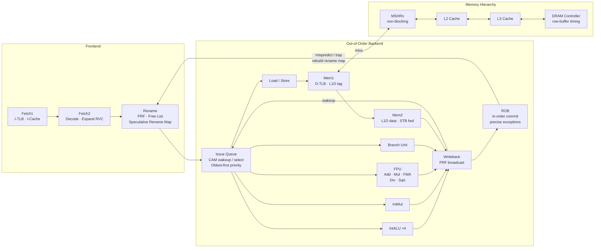
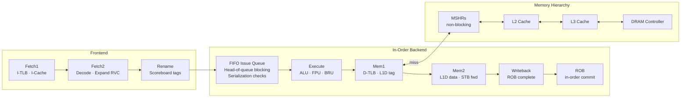

# Pipeline Architecture

rvsim implements two pluggable pipeline backends behind a shared frontend. Both backends share the same Fetch1, Fetch2/Decode, Rename stages and the same Commit, Memory1, Memory2, Writeback stages. This means switching between O3 and in-order is a single config parameter change, and both modes are directly comparable on identical workloads.

## Out-of-Order Backend

10-stage superscalar pipeline with speculative execution, register renaming, and precise exceptions.

### Stage Details

**Fetch1** — Sends the PC to the I-TLB and I-cache in parallel. On an I-TLB miss, the hardware page table walker is invoked. The branch predictor is consulted here: BTB for targets, RAS for returns, and the selected predictor (GShare/TAGE/etc.) for direction. Up to `width` instructions are fetched per cycle.

**Fetch2 / Decode** — Decodes fetched instructions, expands compressed (RVC) 16-bit instructions to their 32-bit equivalents, and generates control signals for the backend. Detects illegal instructions and raises decode-time exceptions.

**Rename** — Maps architectural registers to physical registers using the speculative rename map. Allocates free physical registers from the free list. Writes entries into the ROB and, for loads/stores, the load queue.

**Issue Queue** — CAM-style wakeup/select structure. When an instruction's source operands are written back (broadcast on the result bus), the instruction wakes up and becomes ready to issue. Selection uses oldest-first priority with per-functional-unit-type port limits.

**Execute** — Instructions execute on their assigned functional unit. ALU operations complete in 1 cycle. Multiplies take 3 cycles (pipelined). Divides take 35 cycles (non-pipelined). Branch resolution happens here — on misprediction, the pipeline is flushed.

**Memory1** — Translates virtual addresses through the D-TLB, probes L1D cache tags. On a hit, the data is available for Memory2. On a miss with MSHRs, the load is parked in an MSHR and the pipeline continues. On a miss without MSHRs, the access blocks until the line arrives.

**Memory2** — Reads L1D cache data. Performs store-to-load forwarding from the store buffer (full and partial overlap). Handles NaN-boxing for FP loads, LR/SC reservation checks, and AMO read-modify-write.

**Writeback** — Selects the final result (ALU output, load data, or jump link address), writes it to the physical register file, and marks the ROB entry as completed. Broadcasts the physical register tag for wakeup.

**Commit** — In-order retirement from the head of the ROB. Handles CSR write serialization, FENCE store-drain semantics, SFENCE.VMA deferred TLB flush, MRET/SRET privilege return, and LR/SC reservation validation.

### Design Choices

**Physical register file with dual rename maps.** The speculative rename map tracks the latest mapping and is used during rename. The committed rename map tracks only retired mappings. On a trap, the committed map is restored in one cycle. On a branch misprediction, the speculative map is rebuilt from the committed map plus surviving ROB entries.

**CAM-style issue queue with wakeup/select.** Results broadcast physical register tags on writeback; dependents wake and issue the next cycle. Oldest-first selection ensures forward progress and approximates the behavior of real hardware. Per-type port limits (e.g., 2 load ports, 1 store port) model structural hazards.

**Serialization enforcement.** Four checks at issue time prevent incorrect execution:

1. **System/CSR instructions** wait for all older instructions to complete (`all_before_completed`)
2. **FENCE** instructions wait for older operations matching the predecessor bits (`fence_pred_satisfied`)
3. **Loads/stores** are blocked by older in-flight FENCE instructions with matching successor bits (`has_fence_blocking`)
4. **Loads** wait for all older stores to resolve their addresses (`has_unresolved_store_before`)

**Reorder buffer** — circular buffer with O(1) tag lookup via HashMap. Supports partial flush after branch misprediction (preserves older in-flight work).

**Branch misprediction recovery** — GHR repaired from per-instruction snapshot, RAS restored from snapshot pointer, rename map rebuilt, pipeline flushed after the mispredicting instruction's ROB tag.

**Memory dependence prediction.** The Memory Dependence Unit (MDU) determines at dispatch time whether a load can speculatively bypass unresolved older stores. Two predictors are available:

- **Blind** (default) — conservative, loads always wait for all older stores to resolve their addresses before issuing. Safe but limits memory-level parallelism.
- **Store Set** (Chrysos & Emer, ISCA 1998) — learns load-store dependencies from ordering violations. Each load/store PC is mapped to a *store set ID* via the SSIT (Store Set ID Table). When a load and store share a set, the load waits only for that specific store. Independent loads bypass freely.

The MDU uses two structures:

| Structure | Size | Purpose | Lifetime |
|-----------|------|---------|----------|
| **SSIT** | 2048 entries | Maps `(PC >> 2) % size` → store set ID | Persistent (periodically cleared) |
| **LFST** | 256 entries | Maps store set ID → most recent dispatched store's ROB tag | Cleared on pipeline flush |

On a memory ordering violation (detected at commit), the MDU trains the SSIT to associate the violating load and store PCs into the same store set. Store-store chains are also supported: when multiple stores share a set, each waits for its predecessor. The SSIT is periodically cleared (default: every 100K cycles) to prevent stale dependencies from permanently throttling parallelism.

---

## In-Order Backend

Uses the same frontend and shared backend stages (Commit, Memory1, Memory2, Writeback).

### Design Choices

**Scoreboard-based operand tracking** instead of physical register renaming. At rename time, each instruction captures a tag pointing to the ROB entry that will produce each source operand. The issue stage checks whether those ROB entries have completed; if so, the result is read via tag bypass. If the producing instruction hasn't completed yet, the issue stage stalls.

**FIFO issue with head-of-queue blocking.** The issue queue is a strict FIFO — if the oldest instruction can't issue (operands not ready, serialization constraint), nothing behind it issues either. This models the fundamental limitation of in-order execution.

**Backpressure gating.** The execute-to-memory1 latch has limited capacity. When it's occupied (e.g., the previous instruction is still in the memory pipeline), the issue stage is gated off — no new instructions can issue until the latch drains.

**Same serialization guarantees as O3.** The same four serialization checks (system/CSR, FENCE, FENCE blocking, store address resolution) are enforced at issue time. This ensures correctness and makes the two backends functionally equivalent.

---

## Stage Sharing

The following stages are identical between both backends:

| Stage | Shared? | Notes |
|-------|---------|-------|
| Fetch1 | Yes | Same I-TLB, I-cache, branch predictor |
| Fetch2/Decode | Yes | Same decoder, RVC expansion |
| Rename | **Different** | O3: PRF rename maps. In-order: scoreboard tags. |
| Issue | **Different** | O3: CAM wakeup/select. In-order: FIFO blocking. |
| Execute | **Different** | O3: multiple FUs in parallel. In-order: one instruction. |
| Memory1 | Yes | Same D-TLB, L1D probe, MSHR allocation |
| Memory2 | Yes | Same L1D data, STB forwarding, LR/SC |
| Writeback | Yes | Same result selection, ROB completion |
| Commit | Yes | Same CSR serialization, FENCE semantics |

This design means that a performance difference between O3 and in-order is entirely attributable to the backend's ability to exploit instruction-level parallelism — the memory hierarchy, branch predictor, and instruction semantics are identical.
