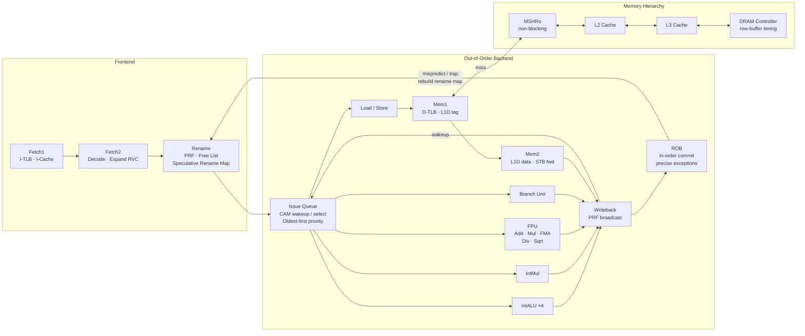
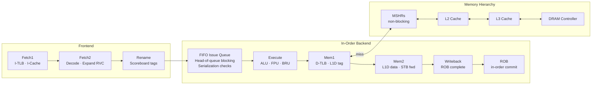

# Pipeline Architecture

rvsim implements two pluggable pipeline backends behind a shared frontend. Both backends share the same Fetch1, Fetch2/Decode, Rename stages and the same Commit, Memory1, Memory2, Writeback stages. This means switching between O3 and in-order is a single config parameter change, and both modes are directly comparable on identical workloads.

## Out-of-Order Backend

10-stage superscalar pipeline with speculative execution, register renaming, and precise exceptions.

```mermaid
flowchart LR
    subgraph Frontend
        F1["Fetch1\nI-TLB · I-Cache"] --> F2["Fetch2\nDecode · Expand RVC"] --> RN["Rename\nPRF · Free List\nSpeculative Rename Map"]
    end

    subgraph Backend ["Out-of-Order Backend"]
        RN --> IQ["Issue Queue\nCAM wakeup / select\nOldest-first priority"]

        IQ --> ALU["IntALU ×4"]
        IQ --> MUL["IntMul"]
        IQ --> FPU["FPU\nAdd · Mul · FMA\nDiv · Sqrt"]
        IQ --> BRU["Branch Unit"]
        IQ --> LSU["Load / Store"]

        ALU & MUL & FPU & BRU --> WB["Writeback\nPRF broadcast"]
        LSU --> M1["Mem1\nD-TLB · L1D tag"] --> M2["Mem2\nL1D data · STB fwd"] --> WB

        WB -->|wakeup| IQ
        WB --> ROB["ROB\nin-order commit\nprecise exceptions"]
        ROB -->|"mispredict / trap\nrebuild rename map"| RN
    end

    subgraph Memory ["Memory Hierarchy"]
        M1 <-->|miss| MSHR["MSHRs\nnon-blocking"]
        MSHR <--> L2["L2 Cache"] <--> L3["L3 Cache"] <--> DRAM["DRAM Controller\nrow-buffer timing"]
    end
```

### Stage Details

**Fetch1** — Sends the PC to the I-TLB and I-cache in parallel. On an I-TLB miss, the hardware page table walker is invoked. The branch predictor is consulted here for the control instructions the BTB knows, as a real front end has only the BTB before decode: its target, the RAS for returns, and the selected predictor (GShare/TAGE/etc.) for direction. Up to `fetch_width` instructions are fetched per cycle; every stage has its own width (`decode_width`, `rename_width`, `issue_width`, `commit_width`), each defaulting to `width`.

**Fetch2 / Decode** — Decodes fetched instructions, expands compressed (RVC) 16-bit instructions to their 32-bit equivalents, and generates control signals for the backend. Detects illegal instructions and raises decode-time exceptions. A control instruction the BTB missed is predicted here and, when it changes the next PC, redirects fetch, which resumes the next cycle; so does a BTB hit that decode finds is not a control instruction, or a direct jump or branch whose BTB target is stale (`bp.decode_redirects`).

**Rename** — Maps architectural registers to physical registers using the speculative rename map. Allocates free physical registers from the free list. Writes entries into the ROB and, for loads/stores, the load queue. After a serializing instruction (CSR access, ECALL, xRET, WFI, SFENCE.VMA, FENCE.I: gem5's `IsSerializeAfter`), the next instruction waits here until the ROB has drained, starting the cycle after commit empties it (`pipeline.stalls.serialize`), as gem5's O3 rename does.

**Issue Queue** — CAM-style wakeup/select structure. When an instruction's source operands are written back (broadcast on the result bus), the instruction wakes up and becomes ready to issue. Selection uses oldest-first priority with per-functional-unit-type port limits.

**Execute** — Instructions execute on their assigned functional unit. A result is written to the physical register file, its dependents woken and its ROB entry completed when the unit's latency has elapsed (ALU 1 cycle, multiply 3 pipelined, divide 35 non-pipelined by default). Branches resolve here; a misprediction, xRET, WFI or FENCE.I produces a `Redirect` that the pipeline takes `redirect_latency` cycles after the result completes, as gem5's squash travels from IEW through commit to fetch. Until it is taken, commit retires nothing the squash will remove and issue keeps executing wrong-path work. A fault raised here (illegal instruction, ECALL, a debug trigger, or a trap carried from fetch or decode) does not redirect: it travels with the instruction, writeback records it on the ROB entry, and commit takes it and flushes everything younger once.

**Memory1** — Translates the address through the D-TLB, walking the page table on a miss. A load then forwards from the store buffer when an older store covers it, taking the L1D hit latency, or sends a request to the L1D and continues when the response arrives. A store writes its address and data into its store-buffer slot here and checks the load queue for younger loads that already read the location (a memory-order violation, which squashes from the load and trains the store-set predictor).

**Memory2** — Finalises a load's value (sign or zero extension, NaN-boxing for FP loads) and records an LR's reservation for commit to set. An AMO or store-conditional arrives here already performed by the cache (its old value, or 0 or 1): it frees its store-buffer slot and squashes any younger load that read its location early. Vector store elements resolve into their buffer here, where their data is final.

**Writeback** — Selects the final result (ALU output, load data, or jump link address), writes it to the physical register file, and marks the ROB entry as completed. Broadcasts the physical register tag for wakeup. The O3 backend writes back at most `writeback_width` results a cycle (gem5's `wbWidth`), memory results first and then functional-unit results earliest-finished and oldest first; the rest wait for a later cycle.

**Commit** — In-order retirement from the head of the ROB. Handles CSR write serialization, FENCE store-drain semantics, SFENCE.VMA deferred TLB flush, MRET/SRET privilege return, and setting an LR's reservation. AMOs and store-conditionals (and an LR with `rl`) are non-speculative, as in gem5: they issue only as the oldest instruction, once every older store has been written, and take effect in the cache.

### Design Choices

**Physical register file with dual rename maps.** The speculative rename map tracks the latest mapping and is used during rename. The committed rename map tracks only retired mappings. On a trap, the committed map is restored in one cycle. On a branch misprediction, the speculative map is rebuilt from the committed map plus surviving ROB entries.

**CAM-style issue queue with wakeup/select.** Results broadcast physical register tags on writeback; dependents wake and issue the next cycle. Oldest-first selection ensures forward progress and approximates the behavior of real hardware. Per-type port limits (e.g., 2 load ports, 1 store port) model structural hazards.

**Serialization enforcement.** Four checks at issue time prevent incorrect execution:

1. **System/CSR instructions** issue only from the head of the ROB, once everything older has retired (`rob.is_head`)
2. **FENCE** instructions wait for older operations matching the predecessor bits (`fence_pred_satisfied`)
3. **Loads/stores** are blocked by older in-flight FENCE instructions with matching successor bits, loads by any older uncommitted CBO, which translates its block in memory1 like a store (a fault is a store fault, taken at commit) and takes effect at commit, and loads by any older atomic with the `aq` bit until it completes (`has_fence_blocking`)
4. **Loads** wait for the older stores the memory-dependence predictor links them to (below); under `Blind`, and always on the in-order backend, that is every older store with an unresolved address (`has_unresolved_store_before`)

**Reorder buffer** — circular buffer with O(1) tag lookup via HashMap. Supports partial flush after branch misprediction (preserves older in-flight work).

**Branch misprediction recovery** — the squash is taken `redirect_latency` cycles after the branch's result completes: GHR repaired from the per-instruction snapshot with the real outcome pushed, RAS restored from its snapshot, rename map restored from a checkpoint or rebuilt, everything after the mispredicting instruction's ROB tag flushed, and fetch redirected. A memory-ordering or coherence violation squashes through the same path.

**Memory dependence prediction.** The Memory Dependence Unit (MDU) determines at dispatch time whether a load can speculatively bypass unresolved older stores. Two predictors are available:

- **Blind** — conservative, loads always wait for all older stores to resolve their addresses before issuing. Safe but limits memory-level parallelism.
- **Store Set** (Chrysos & Emer, ISCA 1998; the default, and gem5 O3's only predictor) — learns load-store dependencies from ordering violations. Each load/store PC is mapped to a *store set ID* via the SSIT (Store Set ID Table). When a load and store share a set, the load waits only for that specific store. Independent loads bypass freely.

The MDU uses two structures:

| Structure | Size | Purpose | Lifetime |
|-----------|------|---------|----------|
| **SSIT** | 1024 entries | Maps `(PC >> 2) % size` → store set ID | Persistent (periodically cleared) |
| **LFST** | 1024 entries | Maps store set ID → most recent dispatched store's ROB tag | Cleared on pipeline flush |

On a memory ordering violation, the MDU trains the SSIT to put the violating load and store PCs in the same store set: a new set is numbered from the load's PC, and when both already have sets the lower-numbered one wins, as in gem5. Store-store chains are also supported: when multiple stores share a set, each waits for its predecessor. Both tables are wiped every 250,000 dispatched loads and stores (gem5's `store_set_clear_period`) so stale dependencies do not throttle a program forever.

---

## In-Order Backend

Uses the same frontend and shared backend stages (Commit, Memory1, Memory2, Writeback).

```mermaid
flowchart LR
    subgraph Frontend
        F1["Fetch1\nI-TLB · I-Cache"] --> F2["Fetch2\nDecode · Expand RVC"] --> RN["Rename\nScoreboard tags"]
    end

    subgraph Backend ["In-Order Backend"]
        RN --> IQ["FIFO Issue Queue\nHead-of-queue blocking\nSerialization checks"]
        IQ --> EX["Execute\nALU · FPU · BRU"]
        EX --> M1["Mem1\nD-TLB · L1D tag"]
        M1 --> M2["Mem2\nL1D data · STB fwd"]
        M2 --> WB["Writeback\nROB complete"]
        WB --> ROB["ROB\nin-order commit"]
    end

    subgraph Memory ["Memory Hierarchy"]
        M1 <-->|miss| MSHR["MSHRs\nnon-blocking"]
        MSHR <--> L2["L2 Cache"] <--> L3["L3 Cache"] <--> DRAM["DRAM Controller"]
    end
```

### Design Choices

**Scoreboard-based operand tracking** instead of physical register renaming. At rename time, each instruction captures a tag pointing to the ROB entry that will produce each source operand. The issue stage checks whether those ROB entries have completed; if so, the result is read via tag bypass. If the producing instruction hasn't completed yet, the issue stage stalls.

**FIFO issue with head-of-queue blocking.** The issue queue is a strict FIFO — if the oldest instruction can't issue (operands not ready, serialization constraint), nothing behind it issues either. This models the fundamental limitation of in-order execution.

**Backpressure gating.** The execute-to-memory1 latch has limited capacity. When it's occupied (e.g., the previous instruction is still in the memory pipeline), the issue stage is gated off — no new instructions can issue until the latch drains.

**Same serialization guarantees as O3.** The same four serialization checks (system/CSR, FENCE, FENCE/CBO blocking, store address resolution) are enforced at issue time. This ensures correctness and makes the two backends functionally equivalent. Where O3 holds rename behind a serializing instruction, the in-order backend squashes and refetches after it, CSR reads included, as gem5's MinorCPU forces a branch after every `IsSerializeAfter` instruction. A redirect is taken `redirect_latency` cycles (default 1, gem5 MinorCPU's execute-to-fetch latch) after the result completes; unlike the O3 backend, nothing the pending squash will remove issues in the meantime.

**Vector memory through the memory stages.** A vector load or store issues from the ROB head and becomes one element micro-op per element address, flowing through Memory1, Memory2 and Writeback like scalar accesses. A load's elements land in the architectural register at writeback; a store's element data waits in the vector store buffer, forwards to younger scalar loads, and is published at commit. Other vector instructions still execute against the architectural registers at issue and flush what follows them.

---

## Stage Sharing

The following stages are identical between both backends:

| Stage | Shared? | Notes |
|-------|---------|-------|
| Fetch1 | Yes | Same I-TLB, I-cache, branch predictor |
| Fetch2/Decode | Yes | Same decoder, RVC expansion |
| Rename | **Different** | O3: PRF rename maps. In-order: scoreboard tags. |
| Issue | **Different** | O3: CAM wakeup/select. In-order: FIFO blocking. |
| Execute | **Different** | O3: multiple FUs in parallel. In-order: one instruction. |
| Memory1 | Yes | Same D-TLB, forwarding, L1D request, store resolution |
| Memory2 | Yes | Same load finalisation, LR reservation and performed AMO/SC |
| Writeback | Yes | Same result selection, ROB completion |
| Commit | Yes | Same CSR serialization, FENCE semantics |

This design means that a performance difference between O3 and in-order is entirely attributable to the backend's ability to exploit instruction-level parallelism — the memory hierarchy, branch predictor, and instruction semantics are identical.
