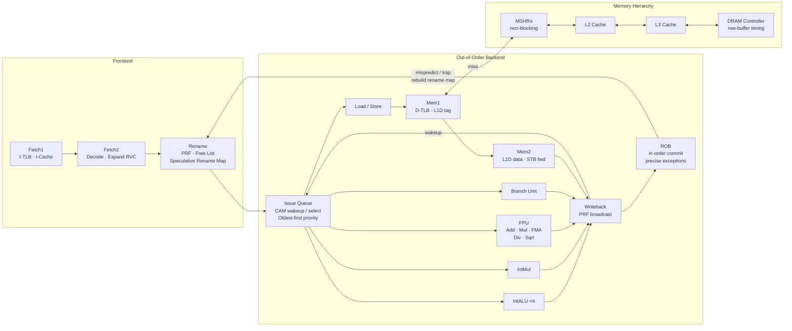
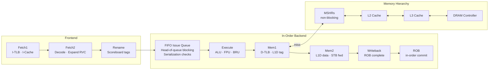

# Pipeline Architecture

rvsim implements two pluggable pipeline backends behind a shared frontend. Both backends share the same Fetch1, Fetch2, Decode and Rename stages and the same Memory1, Memory2, Writeback and Commit stages; they differ in how instructions wait for operands, issue and execute. Switching between them is one configuration parameter (`backend`), and both run the same instruction semantics, so they are directly comparable on identical workloads.

Every stage hands its bundle to the next through a latch with an explicit delay ([decision 4](decisions/0004-latches-carry-an-explicit-delay.md)): one cycle between Fetch2, Decode, Rename and the backend, and none between Fetch1 and Fetch2, because the I-cache response already carries the access latency. The order stages run in within a tick therefore never changes timing.

## Out-of-Order Backend

A superscalar pipeline with speculative execution past predicted branches, register renaming onto physical register files, out-of-order issue, and in-order commit with precise exceptions. In program order an instruction passes Fetch1, Fetch2, Decode, Rename, the issue queue, a functional unit (or Memory1 and Memory2 for an access), Writeback and Commit.

```mermaid
flowchart LR
    subgraph Frontend
        F1["Fetch1\nI-TLB · I-Cache"] --> F2["Fetch2\nDecode · Expand RVC"] --> RN["Rename\nPRF · Free List\nSpeculative Rename Map"]
    end

    subgraph Backend ["Out-of-Order Backend"]
        RN --> IQ["Issue Queue\nCAM wakeup / select\nOldest-first priority"]

        IQ --> ALU["IntALU ×4"]
        IQ --> MUL["IntMul"]
        IQ --> FPU["FPU\nAdd · Mul · FMA\nDiv · Sqrt"]
        IQ --> BRU["Branch Unit"]
        IQ --> LSU["Load / Store"]

        ALU & MUL & FPU & BRU --> WB["Writeback\nPRF broadcast"]
        LSU --> M1["Mem1\nD-TLB · L1D tag"] --> M2["Mem2\nL1D data · STB fwd"] --> WB

        WB -->|wakeup| IQ
        WB --> ROB["ROB\nin-order commit\nprecise exceptions"]
        ROB -->|"mispredict / trap\nrebuild rename map"| RN
    end

    subgraph Memory ["Memory Hierarchy"]
        M1 <-->|miss| MSHR["MSHRs\nnon-blocking"]
        MSHR <--> L2["L2 Cache"] <--> L3["L3 Cache"] <--> DRAM["DRAM Controller\nrow-buffer timing"]
    end
```

### Stage Details

**Fetch1** — Forms a fetch group of up to `fetch_width` PCs inside one cache line, translating through the I-TLB (walking the page table on a miss). A group in the line the I-cache last returned is served from the fetch buffer; any other sends one line-sized request to the L1I. One group is in flight at a time: the next is formed after the previous has returned and Fetch2 has taken it, as gem5's fetch waits on the I-cache and its fetch queue. The branch predictor is consulted here for the control instructions the BTB knows, as a real front end has only the BTB before decode: its target, the RAS for returns, and the selected predictor (GShare/TAGE/etc.) for direction. Every stage has its own width (`fetch_width`, `decode_width`, `rename_width`, `issue_width`, `writeback_width`, `commit_width`), each defaulting to `width`.

**Fetch2 / Decode** — Fetch2 reads each instruction's bytes, reading the upper half of a 32-bit instruction that straddles a page from the next page, and expands compressed (RVC) 16-bit instructions to their 32-bit equivalents. Decode produces each instruction's control signals and turns an illegal encoding into a fault the instruction carries to commit. A control instruction the BTB missed is predicted here and, when it changes the next PC, redirects fetch, which resumes the next cycle; predictions fetch made after it are redone as decode reaches them, without refetching; so does a BTB hit that decode finds is not a control instruction, or a direct jump or branch whose BTB target is stale (`bp.decode_redirects`).

**Rename** — Maps architectural registers to physical registers using the speculative rename map, allocating from the integer, floating-point and vector free lists (`prf_gpr_size`, `prf_fpr_size`, `prf_vpr_size`); a vector register group takes one physical register per member. Source registers are read from the map before the destination is renamed, so `addi x5, x5, 16` sees the previous producer. Writes entries into the ROB and, for loads/stores, the load queue. It allocates into the ROB, issue-queue, load-queue and store-buffer entries that were free at the end of the previous cycle, as pipelined allocation bookkeeping does, so an entry commit or a write acknowledgement frees in one cycle is taken the next. After a serializing instruction (CSR access, ECALL, xRET, WFI, SFENCE.VMA, FENCE.I: gem5's `IsSerializeAfter`), the next instruction waits here until the ROB has drained, starting the cycle after commit empties it (`pipeline.stalls.serialize`), as gem5's O3 rename does.

**Issue Queue** — CAM-style wakeup/select structure. When an instruction's source operands are written back (broadcast on the result bus), the instruction wakes up and becomes ready to issue. Selection uses oldest-first priority with per-functional-unit-type port limits. A plain scalar store issues in two halves, as real out-of-order cores split it into store-address and store-data operations: its address half issues as soon as its base register is ready, taking the store port and an address unit, and its data half issues when the value is ready, writing the store-buffer slot without a unit or port. A store whose operands are both ready issues whole. Atomics, store-conditionals, cache-block operations and vector stores always issue whole (`lsq.split_stores` counts the stores that split).

**Execute** — Instructions execute on their assigned functional unit. A result is written to the physical register file, its dependents woken and its ROB entry completed when the unit's latency has elapsed (ALU 1 cycle, multiply 3 pipelined, divide 35 non-pipelined by default). A vector arithmetic instruction occupies its unit for a time set by `vl` and the lane count: a pipelined unit takes its latency plus one cycle per further element group of `num_vec_lanes` elements, a divider its latency per group, and an unordered reduction adds a tree of log2(lanes) steps (an ordered FP reduction is sequential). With `vec_chaining`, a dependent vector instruction wakes when the first element group is ready rather than when the whole result is, as Saturn's element-group scoreboard does. Branches resolve here; a misprediction, xRET, WFI or FENCE.I produces a `Redirect` that the pipeline takes `redirect_latency` cycles after the result completes, as gem5's squash travels from IEW through commit to fetch. Until it is taken, commit retires nothing the squash will remove and issue keeps executing wrong-path work. A fault raised here (illegal instruction, ECALL, a debug trigger, or a trap carried from fetch or decode) does not redirect: it travels with the instruction, writeback records it on the ROB entry, and commit takes it and flushes everything younger once.

**Memory1** — Translates the address through the D-TLB, walking the page table on a miss. A load then forwards from the store buffer when an older store covers it, taking `store_forward_latency` cycles (the L1D hit latency by default; one cycle is gem5's O3 LSQ; at zero it is written back in this cycle), or sends a request to the L1D and continues when the response arrives. A store writes its address, and its data unless its data half delivers that separately, into its store-buffer slot here and checks the load queue for younger loads that already read the location (a memory-order violation, which squashes from the load and trains the store-set predictor).

**Memory2** — Finalises a load's value (sign or zero extension, NaN-boxing for FP loads) and records an LR's reservation for commit to set. An AMO or store-conditional arrives here already performed by the cache (its old value, or 0 or 1): it frees its store-buffer slot and squashes any younger load that read its location early. Vector store elements resolve into their buffer here, where their data is final.

**Writeback** — Selects the final result (ALU output, load data, or jump link address), writes it to the physical register file, and marks the ROB entry as completed. Broadcasts the physical register tag for wakeup. The O3 backend writes back at most `writeback_width` results a cycle (gem5's `wbWidth`), memory results first and then functional-unit results earliest-finished and oldest first; the rest wait for a later cycle.

**Commit** — In-order retirement from the head of the ROB. A store whose address half has completed retires only once its data half has delivered the data; a load that matches a store whose data has not arrived waits for it. Handles CSR write serialization, FENCE store-drain semantics, SFENCE.VMA deferred TLB flush, MRET/SRET privilege return, and setting an LR's reservation. AMOs and store-conditionals (and an LR with `rl`) are non-speculative, as in gem5: they issue only as the oldest instruction, once every older store has been written, and take effect in the cache.

### Design Choices

**Physical register file with dual rename maps.** The speculative rename map tracks the latest mapping and is used during rename. The committed rename map tracks only retired mappings. On a trap, the committed map is restored in one cycle. On a branch misprediction, the speculative map is restored from the branch's checkpoint when it has one (`checkpoint_count` slots, each taken by a branch at rename), and otherwise rebuilt from the committed map plus the surviving ROB entries. Either way the restore itself is immediate; the time recovery costs is the ROB squash below.

**CAM-style issue queue with wakeup/select.** Results broadcast physical register tags on writeback; dependents wake and issue the next cycle. Oldest-first selection ensures forward progress and approximates the behavior of real hardware. Per-type port limits (e.g., 2 load ports, 1 store port) model structural hazards.

**Serialization enforcement.** Four checks at issue time prevent incorrect execution:

1. **System/CSR instructions** issue only from the head of the ROB, once everything older has retired (`rob.is_head`)
2. **FENCE** instructions wait for older operations matching the predecessor bits (`fence_pred_satisfied`)
3. **Loads/stores** are blocked by older in-flight FENCE instructions with matching successor bits, and loads by any older atomic with the `aq` bit until it completes (`has_fence_blocking`). A CBO translates its block in memory1 like a store (a fault is a store fault, taken at commit) and takes a store-buffer slot, so it is ordered as a store: a younger load of its block waits for it, or forwards zeros from a `cbo.zero`, and one that already read the block is squashed when the CBO resolves
4. **Loads** wait for the older stores the memory-dependence predictor links them to (below); under `Blind`, and always on the in-order backend, that is every older store with an unresolved address (`has_unresolved_store_before`)

**Reorder buffer** — a circular buffer indexed by tag. A squash flushes only what is younger than the squashing instruction and keeps older in-flight work.

**Branch misprediction recovery** — the squash is taken `redirect_latency` cycles after the branch's result completes: GHR repaired from the per-instruction snapshot with the real outcome pushed, RAS restored from its snapshot, rename map restored from a checkpoint or rebuilt, everything after the mispredicting instruction's ROB tag flushed, and fetch redirected. Fetch spends that cycle squashing and fetches the target the cycle after, as gem5's fetch does. Commit squashes the flushed ROB entries at `squash_width` per cycle; dispatch holds while it sees commit squashing and rename while it sees dispatch held, each a cycle late, so rename resumes one cycle after the squash finishes, as gem5's `ROBSquashing` and IEW stall signals propagate; decode of the correct path proceeds meanwhile. A memory-ordering or coherence violation squashes through the same path.

**Memory dependence prediction.** The Memory Dependence Unit (MDU) determines at dispatch time whether a load can speculatively bypass unresolved older stores. Two predictors are available:

- **Blind** — conservative, loads always wait for all older stores to resolve their addresses before issuing. Safe but limits memory-level parallelism.
- **Store Set** (Chrysos & Emer, ISCA 1998; the default, and gem5 O3's only predictor) — learns load-store dependencies from ordering violations. Each load/store PC is mapped to a *store set ID* via the SSIT (Store Set ID Table). When a load and store share a set, the load waits only for that specific store. Independent loads bypass freely.

The MDU uses two structures:

| Structure | Size | Purpose | Lifetime |
|-----------|------|---------|----------|
| **SSIT** | 1024 entries | Maps `(PC >> 2) % size` → store set ID | Persistent (periodically cleared) |
| **LFST** | 1024 entries | Maps store set ID → most recent dispatched store's ROB tag | Cleared on pipeline flush |

On a memory ordering violation, the MDU trains the SSIT to put the violating load and store PCs in the same store set: a new set is numbered from the load's PC, and when both already have sets the lower-numbered one wins, as in gem5. Store-store chains are also supported: when multiple stores share a set, each waits for its predecessor. Both tables are wiped every 250,000 dispatched loads and stores (gem5's `store_set_clear_period`) so stale dependencies do not throttle a program forever.

---

## In-Order Backend

Uses the same frontend and shared backend stages (Commit, Memory1, Memory2, Writeback).

```mermaid
flowchart LR
    subgraph Frontend
        F1["Fetch1\nI-TLB · I-Cache"] --> F2["Fetch2\nDecode · Expand RVC"] --> RN["Rename\nScoreboard tags"]
    end

    subgraph Backend ["In-Order Backend"]
        RN --> IQ["FIFO Issue Queue\nHead-of-queue blocking\nSerialization checks"]
        IQ --> EX["Execute\nALU · FPU · BRU"]
        EX --> M1["Mem1\nD-TLB · L1D tag"]
        M1 --> M2["Mem2\nL1D data · STB fwd"]
        M2 --> WB["Writeback\nROB complete"]
        WB --> ROB["ROB\nin-order commit"]
    end

    subgraph Memory ["Memory Hierarchy"]
        M1 <-->|miss| MSHR["MSHRs\nnon-blocking"]
        MSHR <--> L2["L2 Cache"] <--> L3["L3 Cache"] <--> DRAM["DRAM Controller"]
    end
```

### Design Choices

**Scoreboard-based operand tracking** instead of physical register renaming. At rename time, each instruction captures a tag pointing to the ROB entry that will produce each source operand. Issue reads an operand from the architectural register file when it has no producer, or bypasses it from the producer's ROB entry once the producer's unit has delivered it; if the producer is still executing, issue stalls.

**Superscalar in-order issue.** Up to `issue_width` instructions issue per cycle, in program order, each taking a unit from the same functional-unit pool as the out-of-order backend (the default `Fu()`). A result is delivered when its unit's latency has elapsed, and a dependent can issue in the cycle it is delivered, so a multiply followed by its consumer costs the multiply's latency, not one cycle. Decode stops a bundle at a register dependency inside it, so an instruction never issues alongside its producer.

**FIFO issue with head-of-queue blocking.** The issue queue is a strict FIFO: if the oldest instruction cannot issue (operands not ready, no free unit, a serialization constraint), nothing behind it issues either. This models the fundamental limitation of in-order execution. A cycle in which issue found nothing to issue counts as `pipeline.stalls.data`, and one in which the head waited for a busy unit as `pipeline.stalls.fu_structural`.

**Backpressure gating.** When Memory1 could not take everything in the execute-to-memory1 latch (a translation walk, or a load waiting for the store buffer to drain), issue is gated off until it drains, as a stalled in-order pipeline holds every stage behind the one that stalls.

**Same serialization guarantees as O3.** The same four serialization checks (system/CSR, FENCE, `aq` blocking, store address resolution) are enforced at issue time. This ensures correctness and makes the two backends functionally equivalent. Where O3 holds rename behind a serializing instruction, the in-order backend squashes and refetches after it, CSR reads included, as gem5's MinorCPU forces a branch after every `IsSerializeAfter` instruction. A redirect is taken `redirect_latency` cycles (default 1, gem5 MinorCPU's execute-to-fetch latch) after the result completes; unlike the O3 backend, nothing the pending squash will remove issues in the meantime.

**Vector memory through the memory stages.** A vector load or store issues from the ROB head and becomes micro-ops flowing through Memory1, Memory2 and Writeback like scalar accesses: one per element for strided and indexed accesses, and for a unit-stride access (plain, segment, fault-only-first, mask or whole-register) one per `vector_mem_width`-byte window of its naturally aligned elements, which the vector load-store path moves in one L1D access (Saturn moves a datapath-width beat; gem5, one register per micro-op). A span that meets a fault, a debug trigger or a device is taken apart into its elements, so each meets it on its own; the instruction faults at the lowest faulting element once all its micro-ops have finished. A span load forwards only from a vector store holding all its bytes and otherwise waits for an overlapping store to be written. A load's elements land in the architectural register at writeback; a store's element data waits in the vector store buffer, forwards to younger scalar loads, and is published at commit. Other vector instructions issue only as the oldest instruction and execute against a shadow of the architectural vector registers, taking their unit for the same `vl`-dependent time as on the out-of-order backend; their writes land at commit, and what follows them is squashed and refetched so it reads the result.

---

## Stage Sharing

The following stages are identical between both backends:

| Stage | Shared? | Notes |
|-------|---------|-------|
| Fetch1 | Yes | Same I-TLB, I-cache, branch predictor |
| Fetch2/Decode | Yes | Same decoder, RVC expansion |
| Rename | **Different** | O3: PRF rename maps. In-order: scoreboard tags. |
| Issue | **Different** | O3: CAM wakeup/select. In-order: FIFO blocking. |
| Execute | **Different** | O3: any ready instruction on any free unit. In-order: up to `issue_width` in program order on the same unit pool. |
| Memory1 | Yes | Same D-TLB, forwarding, L1D request, store resolution |
| Memory2 | Yes | Same load finalisation, LR reservation and performed AMO/SC |
| Writeback | Yes | Same result selection, ROB completion |
| Commit | Yes | Same CSR serialization, FENCE semantics |

This design means that a performance difference between O3 and in-order is entirely attributable to the backend's ability to exploit instruction-level parallelism — the memory hierarchy, branch predictor, and instruction semantics are identical.
